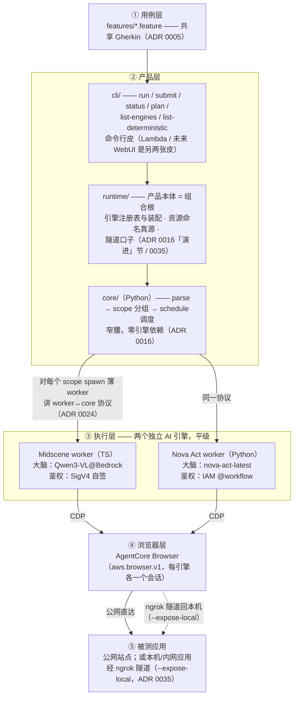

# Gherkin × (Midscene + Nova Act) × AgentCore Browser

一套 UI 自动化测试框架原型：用 **Gherkin** 描述测试意图，由两个互相独立的 **AI 引擎**（Midscene / Nova Act）执行，由 **AWS Bedrock AgentCore** 云端浏览器承载。三层正交，靠 CDP（Chrome DevTools Protocol）串联。

> 术语与设计决策见 [`CONTEXT.md`](./CONTEXT.md) 和 [`docs/adr/`](./docs/adr/)，**给人的阅读理解文档**见 [`docs/guides/`](./docs/guides/)（机制解读/横切视图等 explanation；权威在 ADR），外部一手来源见 [`docs/REFERENCES.md`](./docs/REFERENCES.md)。（初始蓝图 `midscene-novaact-prototype-guide.md` 已退役——其内容被 CONTEXT+ADR 全面覆盖且经实测更正。）

## 现状（已端到端验证）

架构：**核心库 `core/`（Python）自解析 Gherkin → 分组 scope/job → 调度**，每个 scope spawn 一个**薄 worker 子进程**（Midscene=TS / Nova Act=Python），worker 讲统一的 worker↔core 协议（ADR 0024）。`cli/` 是核心库的第一张前端皮（argparse + render），组合根共享层在 `runtime/`（ADR 0016「演进」节）。已**退役** v0.x 的 cucumber-js/pytest-bdd 双 runner 直跑（见 ADR 0016 执行架构 / 0022 BDD runner 退役 / 0023 核心语言）。

三层链路 + v1.0 核心库均已在真实 AWS 账号端到端验证：

| 能力       | 内容                                                                                                    | 状态                                                            |
|------------|---------------------------------------------------------------------------------------------------------|-----------------------------------------------------------------|
| 双引擎执行 | 同一份 `.feature` → 两个引擎薄 worker（cli 经 `@engine` tag 路由）                                        | ✅ 端到端真跑                                                    |
| 云端浏览器 | 两个引擎都接 AgentCore Browser（各自一个会话，CDP 驱动）                                                   | ✅                                                               |
| 核心库     | parse + scope 分组 + schedule 调度 + 4 ports（Engine/Run/Result/ReportStore）+ 实时写编排（RunPersistence） | ✅ 单测覆盖                                                      |
| 云端 store | 状态落 DynamoDB、判定结果与报告落 S3（+ StepArgument offload 解 DDB 400KB 限），boto3 只在云端路径懒加载（库层 extra `gherkai-core[aws]` / `gherkai-runtime[aws]`；CLI 发行包 `gherkai` 硬依赖 `gherkai-runtime[aws]`，ADR 0037）    | ✅ 已接 cli（`--backend cloud`）、真 AWS 端到端；moto 单测对拍 local |
| 投票治理   | AI 断言可配 N 次取多数票（`--assertion-votes`，治抖动）                                                    | ✅                                                               |
| RunReport  | 跨引擎归集索引（manifest + index，不融合产物）                                                             | ✅                                                               |
| 网络韧性   | 建连两层重试 + network_error 分类 + SIGTERM 会话泄漏根治                                                | ✅                                                               |

> **承接 v0.x 顺延项（待真实业务系统）**：≥3 真实用例 QA 零代码验收 + 破例清单——当前用骨架用例（wikipedia/example.com）验证方向，真实系统验收顺延。

> **v1.1 云端**：云端 store adapter（DynamoDB/S3）+ **执行面 Fargate/ECS 均已建成 + 真部署真跑**——`--backend cloud` 一个旋钮同时切「存储上云 + worker 跑 Fargate 容器」（`FargateEngine` adapter + `gherkai-deploy-aws` 包的 CDK stack、经 `gherkai deploy` 部署，ADR 0032/0033/0037）。配置与退出码分层见 [`cli/README.md`](./cli/README.md)。

> **v1.2 无状态跑批**（已实装，ADR 0034）：`submit` 提交完就走、返回 run_id，`status [--wait]` 轮询/接力收集——CLI 不必守着 run。local 档起 per-run 后台进程（setsid 脱离 CLI）+ SQLite events 推进；cloud 档三 Lambda 事件驱动链（kicker 冷启动 / reconciler 主推进 / 退出观察者）由 DDB Stream + EventBridge 驱动，submit 机器权限收窄到「提交那一下」。同步 `run` 命令保留不变。每个 job 有墙钟预算兜底（缺省 300s，`@timeout:` tag 按用例声明）——三种跑法都强制执行，提交完就走也不怕挂死/无限烧钱。

> **v1.3 本地应用测试**（已实装，ADR 0035）：`--expose-local http://localhost:3000`（run/submit 均可）把「跑 CLI 的机器可达」的被测应用经 **ngrok 隧道**暴露给云端浏览器——本地开发中的应用不必发布即可被测。feature 里照写原始地址，框架提交时替换为公网 URL；basic-auth 默认开启（随机凭据每 run 一换、终态即拆、边缘拦截）。四种「跑法×backend」组合全支持（cloud submit 由本机守护进程持有隧道，需保持开机到 run 终态）。**同版还含确定性能力暴露**（ADR 0036）：`list-deterministic` 按引擎列出可复用的确定性 step（worker 注册表自述，零漂移），`plan` 对每个 step 标注派发预期（命中确定性/走 AI，含冲突预检）——写 feature 的人不再对引擎侧能力两眼一抹黑。

## 架构速览



关键约束：**全栈托管在 AWS 内**（ADR 0009）；**范围限英文 UI**（ADR 0001）。

## 目录结构

```
./
├── README.md                  ← 本文件
├── CONTEXT.md                 ← 领域术语表（glossary）
├── CLAUDE.md                  ← 项目约定（沟通/文档纪律/代码纪律/工作方式）——给 AI coding agent 与人
├── pyproject.toml / uv.lock   ← uv workspace 根（成员 = core / runtime / cli / engines/novaact / deploy_aws 五个发行包）：单一 lock + 共用 dev 依赖与 pytest 配置（ADR 0037）
├── .github/                   ← CI 与发布链（workflows/{ci,release}.yml + scripts/；一次性人工前置与本地校验见 .github/workflows/README.md，ADR 0037 决策 8）
├── docs/                      ← 架构决策与过程记录
│   ├── adr/                   ← 架构决策记录（0001–0038）
│   ├── guides/                ← 给人的阅读理解文档（机制解读/横切合成等，只讲 how、权威在 ADR）
│   ├── journey/               ← 任务推进的 staging 区（过程产物，吸收进 ADR/code 后即删，见 CLAUDE.md「文档纪律」）
│   ├── REFERENCES.md          ← 外部一手来源
│   └── {doc,code}-health-review.md  ← 文档/代码健康度复盘方法
├── features/                  ← 共享 .feature（同一份两个引擎同读；通用 step 风格，QA 零代码）
│   ├── wikipedia_generic.feature / wikipedia_assertions.feature / wikipedia_robustness.feature
│   ├── engine_routing.feature              ← @engine tag 路由验证
│   ├── deterministic_anchor.feature        ← @deterministic 锚点验证（ADR 0022）
│   └── concurrency_and_scope.feature       ← 手工真跑回归夹具：改调度/会话生命周期后重跑验 ADR 0019
├── core/                      ← 窄腰核心库（发行名 gherkai-core，Python，零引擎依赖，ADR 0016）
│   └── gherkai_core/{parse,scope,schedule,project,reconcile,persist,model,wire,serialize,ports,errors}.py（project=纯归约投影 / reconcile=无状态推进编排，ADR 0034）+ adapters/{subprocess,fargate}_engine.py + adapters/cloud_launcher.py + adapters/event_log/{sqlite,ddb}.py（无状态跑批持久事件通道，ADR 0034）+ adapters/{run,result,report}_store/{local,ddb|s3}.py
├── runtime/                   ← 产品本体 = 组合根共享层（发行名 gherkai-runtime；ADR 0016「演进」节；cli/Lambda/WebUI 的共同地基）
│   └── gherkai_runtime/{compose.py(引擎注册表/装配·云目标解析) · detached.py(local 无状态跑批宿主) · names.py(资源命名真源) · tunnel.py(--expose-local 隧道 provider，ADR 0035) · tunnel_host.py(隧道宿主编排+守护 TTL，ADR 0035)}
├── cli/                       ← 命令行皮（发行名 gherkai，命令 gherkai；ADR 0016）
│   └── gherkai_cli/{__main__.py(argparse) · deploy.py(部署 provider 发现/分派皮) · render.py}
├── engines/                   ← 两个可插拔引擎，与 core 平级
│   ├── midscene/   ← npm 包 @gherkai/worker-midscene（ESM）：src/bin.mts（入口）· src/worker/run-scope.mts（薄 worker）· src/worker/deterministic.mts · src/lib/agentcore-sigv4.mts · spikes/
│   └── novaact/    ← 发行包 gherkai-worker-novaact：gherkai_worker_novaact/{run_scope.py（薄 worker）· deterministic.py · user_steps.py · lib/workflow_setup.py} · spikes/
├── deploy_aws/                ← 发行包 gherkai-deploy-aws：`gherkai deploy` 的 AWS provider（Python CDK stack：DDB/S3/ECS/ECR/IAM/VPC + 无状态跑批的 Stream/Lambda/EventBridge；`gherkai_deploy_aws/lambdas/` 是三 Lambda 的 handler 源、随部署打进 asset；worker 镜像交付 `push-worker` / `list-workers`，ADR 0033/0034/0037/0038）
└── tools/                     ← 复用工具库（端到端真跑 / 跨真实边界验证 / 时序诊断；长期资产，见 CLAUDE.md「工作方式」）
```

## 前置要求

- AWS 凭证（默认 profile 即可），region **us-east-1**，需具备：
  - Bedrock 模型访问：`qwen.qwen3-vl-235b-a22b`（Midscene 大脑）
  - AgentCore Browser（`bedrock-agentcore` 服务）
  - Nova Act 服务（`nova-act`）+ 模型 `nova-act-latest`
- Nova Act workflow definition（IAM 路径必需）：**代码会自动 create-if-not-exists**（`engines/novaact/gherkai_worker_novaact/lib/workflow_setup.py`），无需手动操作。若想手动预建也可：`aws nova-act create-workflow-definition --region us-east-1 --name spike-wikipedia-benchmark`（见 ADR 0004）。
- Node ≥22（midscene worker；`gherkai deploy` 的 CDK/cdk CLI 同一下限）、Python 3.13 + uv（五个 workspace 成员）
- （可选，仅 `--expose-local` 本地应用测试需要）[ngrok](https://ngrok.com/download) + authtoken（**注册免费账号即够**，付费账号亦可；`ngrok config add-authtoken <token>`——注意是 dashboard 上的 **Authtoken**，不是 `cr_` 开头的 API key）

## 安装（使用者：PyPI / npm 发行版，ADR 0037）

```bash
uv tool install gherkai                     # 只提交云端 run 的人：CLI 本体（含 AWS 依赖）
uv tool install 'gherkai[local]'            # 本机跑 novaact worker（--backend local）
npm i -g @gherkai/worker-midscene           # 本机跑 midscene worker（Node ≥22；CLI 按 PATH 定位）
uv tool install 'gherkai[deploy-aws]'       # 部署方：gherkai deploy / push-worker（另需 Node ≥22、docker）
uvx gherkai --version                       # 或免安装临时跑（uvx --from 'gherkai[local]' gherkai run …）
```

版本由 git tag 派生、五个 Python 包 `==` 同号锁定；CLI 与已部署后端的版本 skew 在 `--backend cloud` 预检时比对（细节见 [`cli/README.md`](./cli/README.md)）。

## 运行（经核心库 cli，一个入口跑两个引擎）

```bash
# 开发者（仓库内）首次安装：两条都在仓库根执行（见下「注意」）；使用者装发行版见上节
uv sync                                            # 五个 workspace 成员（core/runtime/cli + novaact worker + deploy-aws provider）一次装齐（uv workspace，共用根 .venv/）
(cd engines/midscene && npm ci && npm run build)   # Midscene worker（npm 包，Node 22）：装依赖 + 编译到 dist/
# dev 态让 CLI 用本仓库的 midscene worker（发布后用户走 `npm i -g @gherkai/worker-midscene`，不需此步）：
export GHERKAI_WORKER_MIDSCENE_CMD="node $PWD/engines/midscene/dist/bin.mjs"
```

第一条 `uv sync` 把五个 workspace 成员（`gherkai-core` / `gherkai-runtime` / `gherkai` / `gherkai-worker-novaact` / `gherkai-deploy-aws`）以 editable 装进仓库根的同一个 `.venv/`（ADR 0037：单一 workspace、单一 `uv.lock`）。此后**在仓库根**敲：`uv run gherkai <子命令>` 跑 CLI（`gherkai` 是安装出来的命令），`uv run pytest` 跑全部成员的单测。

跑法由**两个正交旋钮**组合出来（四种组合都合法），按需各选一档：

- **怎么跑**——前台 `run`（CLI 在线守着，跑完直接给结果）或后台 `submit` + `status`（提交即走，事后查/收）。
- **跑在哪 / 落在哪**（`--backend`）——`local`（默认：worker 跑本机子进程，结果落本地 `reports/`）或 `cloud`（worker 跑 Fargate 容器，状态落 DynamoDB、结果落 S3；需先由部署方跑 `gherkai deploy --vpc <档> --prefix <前缀>` 建齐全部资源——IaC 住 `gherkai-deploy-aws` 包、装 `gherkai[deploy-aws]`，见 [`deploy_aws/README.md`](./deploy_aws/README.md)）。

### ① 先预检（纯本地、不烧钱）

```bash
uv run gherkai plan features/engine_routing.feature   # 看 scope/job 分组、engine 路由、校验配置；
                                                      # 每个 step 还标注派发预期：命中确定性锚点的标
                                                      # 「← 确定性: <说明>」，纯自然语言步走 AI（不标）
uv run gherkai list-engines                           # 列可用引擎
uv run gherkai list-deterministic --engine midscene   # 列该引擎支持的确定性 step（--json 可选，ADR 0036）
```

`list-deterministic` 输出示例（写 feature 时查询可复用的精确断言，照 `示例` 一行抄进 feature 即可）：

```
引擎 midscene 的确定性 step（1 条；test engineer 在 worker 注册表维护，ADR 0022/0036）：
  - 断言当前页面 URL 匹配给定正则（精确判定，不走 AI、不投票）
    示例: Then 页面地址匹配 "/wiki/OpenAI"
    模式: 页面地址(?:精确)?匹配 "(?<pattern>[^"]+)"
```

**先 `plan` 后跑**——真跑烧钱（模型调用 + AgentCore 会话），plan 是纯本地预检。

### ② 前台跑：`run`

```bash
# engine 由 @engine tag 选、未标用 --default-engine
AWS_REGION=us-east-1 uv run gherkai run features/engine_routing.feature
# 调高投票治抖动 / 放开并发 / JSON 输出：
AWS_REGION=us-east-1 uv run gherkai run features/wikipedia_generic.feature \
  --default-engine midscene --assertion-votes 3 --max-concurrency 2 --json
```

默认（local）落盘到当前目录下的 `reports/<run_id>/`（`--report-dir` 可改）：判定真值（`jobs/`）+ 控制面（`run_meta.json`/`run_state.json`）+ RunReport（`index.html` 人看入口 + `manifest.json`）。**边跑边写**：run 开始即落 definition + 初始态，每个 scope 起跑刷 RUNNING、完成即落判定，最后 finalize 总状态。

加 `--backend cloud` 即同一条命令换云端档：worker 改跑 Fargate 容器、状态落 DynamoDB、判定真值与报告落 S3（`--prefix` 与 `gherkai deploy --prefix` 一致即可，表/桶/cluster 名由它批量推导）：

```bash
AWS_REGION=us-east-1 uv run gherkai run features/engine_routing.feature \
  --backend cloud --prefix gherkai-
```

### ③ 后台跑批：`submit` + `status`（提交即走；内部称「无状态跑批」，ADR 0034）

`run` 要求 CLI 全程在线（断网/关终端即中止）。`submit` 提交完立即返回 run_id、推进在别处发生，事后用 `status` 查进度/收结果：

```bash
# local 档：本机 fork 一个脱离 CLI 的后台进程推进——不必守着终端，但本机需保持开机
RUN_ID=$(uv run gherkai submit features/wikipedia_generic.feature)
uv run gherkai status "$RUN_ID"            # 查一眼进度（只读、不推进）
uv run gherkai status "$RUN_ID" --wait     # 等到终态、按判定给退出码——CI 要 0/1 判定用这个

# cloud 档：definition 落 DynamoDB 即返回，之后由云端 Lambda 事件驱动链推进——提交完关机也跑完
RUN_ID=$(uv run gherkai submit features/wikipedia_generic.feature --backend cloud --prefix gherkai-)
uv run gherkai status "$RUN_ID" --backend cloud --prefix gherkai- --wait
```

提交完就走不等于失控：每个 job 有墙钟预算兜底（缺省 300s；`@timeout:<秒>` tag 按用例声明、`--default-job-timeout` 改缺省）——卡死/超预算的 job 会被自动停掉并判 `error(timeout)`，local 挂死、cloud 无限烧钱都由它止损。`status` 的 `--backend`/`--report-dir`/`--prefix` 须与 `submit` 时一致（否则查不到）。选项全表、退出码分层、submit/status 语义细节见 [`cli/README.md`](./cli/README.md)。

### ④ 测本地/内网应用：`--expose-local`

被测应用跑在本机（或 CLI 机器可达的内网机器）、没有公网入口？加一个 flag 即可——框架自动起 ngrok 隧道暴露给云端浏览器，feature 里照写原始地址：

```bash
# feature 里写的是 http://localhost:3000（原始地址，plan 也显示它）；
# 框架起隧道后在提交时替换为公网 URL（带每 run 一换的 basic-auth 凭据、终态即拆）
uv run gherkai run my_app.feature --expose-local http://localhost:3000
RUN_ID=$(uv run gherkai submit my_app.feature --expose-local http://localhost:3000)
```

前置：装 ngrok + 配 authtoken（见上「前置要求」）。`submit` 后隧道由后台进程持有（cloud 档为守护进程）——**本机需保持开机联网直到 run 终态**。设计与边界见 ADR 0035。

两个引擎读的是**同一份** `features/` 下 `.feature`（通用 step 风格，QA 只写自然语言）。

### 怎么写 `.feature`（QA 零代码，ADR 0020）

- 动作/断言都写**纯自然语言、无路由关键词**：`When "搜索 OpenAI"` / `Then "进入了 OpenAI 词条页"` → 默认走 AI（动作=aiAct/act；断言=aiBoolean/act_get+投票）。
- scope/引擎/超时预算用 **tag**（ADR 0019）：`@scope:login`（共享会话、串行）/ `@engine:midscene|novaact`（选引擎）/ `@timeout:120`（该 scope 的 job 墙钟预算秒；未标用 `--default-job-timeout` 缺省，同 scope 声明不一致报 PlanError）。
- **确定性精确检查**（URL/DOM，不容 AI 抖动）：由 test engineer 在**自己项目的 `steps/` 目录**写 `@deterministic` 注册（Python 侧 `*.py` 给 novaact、TS 侧 `*.mts` 给 midscene，同一正则两侧对称；命中走精确 handler、不投票，ADR 0022）。CLI 按 `--steps-dir` > env `GHERKAI_STEPS_DIR` > `./steps` 找到该目录、注给 worker（ADR 0037 决策 4）；任一文件加载失败即拒绝运行（fail-loud）。QA 不碰实现，但**可发现可复用**：`list-deterministic` 查当前引擎有哪些（含定制）、`plan` 看自己写的 step 会不会命中（ADR 0036）。
- **多行参数**：AI 动作/断言 step 可挂 Gherkin DataTable/DocString，worker 拼成附加文本随 step 一起喂 AI（ADR 0024）。

## Spike（可独立跑的技术验证脚本）

```bash
# Midscene 引擎三段隔离自检（模型连接 / 浏览器连接(CDP) / 合体；另有 04 planning 探针 / 05 负向断言，见 engines/midscene/README.md）
cd engines/midscene && AWS_REGION=us-east-1 node_modules/.bin/tsx spikes/01-model-sigv4.ts
# 02-agentcore-cdp.ts / 03-midscene-grounding.ts 同理

# Nova Act 引擎对标 spike
AWS_REGION=us-east-1 uv run python engines/novaact/spikes/wikipedia_benchmark.py   # 用仓库根 .venv（novaact 无独立 venv）
```

## 发布与版本（维护者）

**版本真源只有 git tag `vX.Y.Z`**——五个 Python 发行包、npm 包 `@gherkai/worker-midscene`、两个 worker
基底镜像同号，pyproject 与 package.json 里都没有手写版本号（ADR 0037 决策 2b/7）。发布因此是一个动作：

```bash
git tag v1.4.0 && git push origin v1.4.0   # GitHub Actions 接手：gate（版本==tag）→ PyPI → npm → GHCR 基底镜像 → GitHub Release
```

CI（push `main` / PR）跑三件：全成员 `pytest`、midscene 的 `npm ci && npm run build && npm test`、
`uv build --all-packages` 的打包元数据 smoke。

一次性人工前置（PyPI 占名与 trusted publisher、npm token secret、GHCR 包可见性）、TestPyPI 演练、
以及**不推 tag 也能做的本地静态校验**，全在 [`.github/workflows/README.md`](./.github/workflows/README.md)；
决策与理由在 [ADR 0037 决策 8](./docs/adr/0037-distribution-and-packaging.md)。

## 注意

- 运行会真实消耗 AWS 费用（模型调用 + AgentCore 会话）。
- 环境隔离：三个 Python 发行包（core/runtime/cli）与 Nova Act worker（`gherkai-worker-novaact`，经 CLI 的 `[local]` extra）都装在仓库根 `.venv`（uv workspace 单一 `uv.lock`；worker 与 CLI 同 venv 是设计——`python -m gherkai_worker_novaact` 无包装层、fd 直达，ADR 0037 决策 3），Midscene worker 的 TS 依赖在 `engines/midscene/node_modules`——均不污染全局。
