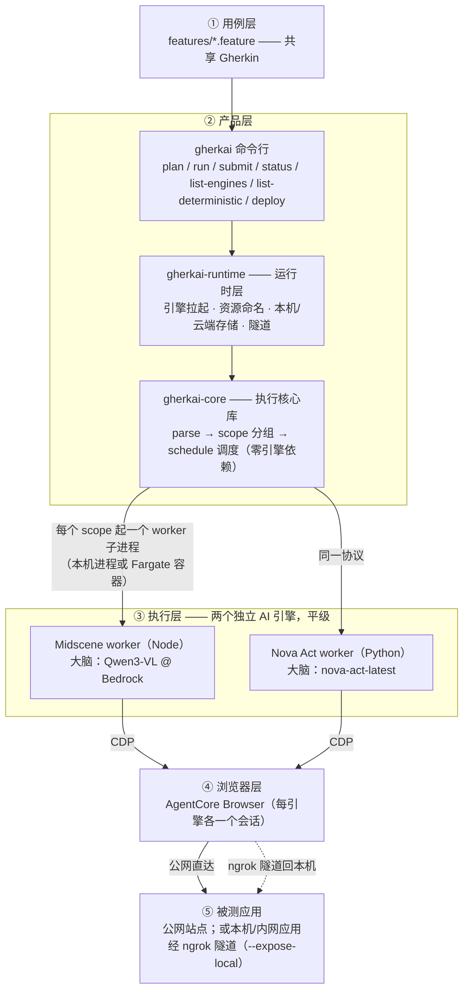

# Gherkin × (Midscene + Nova Act) × AgentCore Browser

**gherkai** 是一套 UI 自动化测试框架：用 **Gherkin** 写测试意图（QA 零代码），由两个互相独立的 **AI 引擎**（Midscene / Nova Act）执行，浏览器由 **AWS Bedrock AgentCore** 在云端承载。同一份 `.feature` 两个引擎同读；AI 断言可多次投票治抖动；需要精确的检查（URL/DOM）由测试开发写成确定性 step，走 Playwright、不走 AI。

## 能做什么

| 能力 | 说明 |
|---|---|
| 双引擎执行 | 同一份 `.feature`，按 `@engine` tag 路由到 Midscene 或 Nova Act；未标走默认引擎 |
| 云端浏览器 | 两个引擎都接 AgentCore Browser（每个 scope 一个会话），本机不装 Chromium |
| 本机 / 云端两档 | `--backend local`：worker 跑本机子进程、结果落 `reports/`；`--backend cloud`：worker 跑 Fargate、状态落 DynamoDB、结果落 S3 |
| 前台 / 后台两种跑法 | `run` 在线守着出结果；`submit` 提交即走、`status --wait` 事后收——cloud 档提交完关机也跑完 |
| 投票治理 | AI 断言可配 N 次取多数票（`--assertion-votes`） |
| 确定性 step | 项目里的 `steps/` 目录注册精确断言，`plan` 预检标注哪些 step 走确定性、哪些走 AI |
| 本机应用测试 | `--expose-local http://localhost:3000` 经 ngrok 隧道把本机可达的应用暴露给云端浏览器 |
| 预算兜底 | 每个 job 有墙钟预算（缺省 300s，`@timeout:` tag 可改），卡死/超时自动停、不会计费失控 |
| 跨引擎报告 | 每个 run 一份 RunReport（`index.html` 人看入口 + `manifest.json`） |

## 架构速览



全栈托管在 AWS 内；当前范围限英文 UI。

## 前置要求

- AWS 凭证（默认 profile 即可），region **us-east-1**，需具备：
  - Bedrock 模型访问：`qwen.qwen3-vl-235b-a22b`（Midscene 大脑）
  - AgentCore Browser（`bedrock-agentcore` 服务）
  - Nova Act 服务（`nova-act`）+ 模型 `nova-act-latest`（所需的 workflow definition 首次运行时自动创建）
- Node ≥22（Midscene worker；`gherkai deploy` 同一下限）、Python 3.13 + [uv](https://docs.astral.sh/uv/)
- （可选，仅 `--expose-local` 需要）[ngrok](https://ngrok.com/download) + authtoken（免费账号即够；`ngrok config add-authtoken <token>`——是 dashboard 上的 **Authtoken**，不是 `cr_` 开头的 API key）

## 安装

```bash
uv tool install gherkai                     # 只提交云端 run 的人：CLI 本体
uv tool install 'gherkai[local]'            # 本机跑 Nova Act worker（--backend local）
npm i -g @gherkai/worker-midscene           # 本机跑 Midscene worker（Node ≥22；CLI 按 PATH 定位）
uv tool install 'gherkai[deploy-aws]'       # 部署方：gherkai deploy / push-worker（另需 Node ≥22、docker）
uvx gherkai --version                       # 或免安装临时跑（uvx --from 'gherkai[local]' gherkai run …）
```

版本由 git tag 派生、各包同号锁定；CLI 与已部署后端的版本在 `--backend cloud` 预检时比对，不一致会明确提示怎么办。各包页面：[`gherkai`](https://pypi.org/project/gherkai/)（CLI）· [`gherkai-worker-novaact`](https://pypi.org/project/gherkai-worker-novaact/) · [`@gherkai/worker-midscene`](https://www.npmjs.com/package/@gherkai/worker-midscene) · [`gherkai-deploy-aws`](https://pypi.org/project/gherkai-deploy-aws/) · 库层 [`gherkai-core`](https://pypi.org/project/gherkai-core/) / [`gherkai-runtime`](https://pypi.org/project/gherkai-runtime/)。

## 上手

跑法由**两个正交旋钮**组合出来（四种组合都合法）：

- **怎么跑**——前台 `run`（CLI 在线守着，跑完直接给结果）或后台 `submit` + `status`（提交即走，事后查/收）。
- **跑在哪 / 落在哪**（`--backend`）——`local`（默认：worker 跑本机子进程，结果落本地 `reports/`）或 `cloud`（worker 跑 Fargate 容器，状态落 DynamoDB、结果落 S3；需先由部署方跑 `gherkai deploy --vpc <档> --prefix <前缀>` 建齐资源，见 [`deploy_aws/README.md`](./deploy_aws/README.md)）。

### ① 先预检（纯本地、零费用）

```bash
gherkai plan features/engine_routing.feature   # 看 scope/job 分组、engine 路由、校验配置；
                                               # 每个 step 标注派发预期：命中确定性 step 的标「← 确定性: <说明>」，纯自然语言步走 AI
gherkai list-engines                           # 列可用引擎（某引擎没装会原地给装法）
gherkai list-deterministic --engine midscene   # 列该引擎支持的确定性 step（含你项目 steps/ 里的；--json 可选）
```

**先 `plan` 后跑**——真跑会产生真实 AWS 费用（模型调用 + AgentCore 会话），plan 是纯本地预检。

### ② 前台跑：`run`

```bash
AWS_REGION=us-east-1 gherkai run features/engine_routing.feature      # engine 由 @engine tag 选、未标用 --default-engine
AWS_REGION=us-east-1 gherkai run features/wikipedia_generic.feature \
  --default-engine midscene --assertion-votes 3 --max-concurrency 2 --json
```

默认（local）落盘到当前目录 `reports/<run_id>/`（`--report-dir` 可改）：判定真值（`jobs/`）+ 运行状态 + RunReport（`index.html` / `manifest.json`），边跑边写。加 `--backend cloud --prefix <前缀>` 即换云端档（`--prefix` 与部署时一致）。

### ③ 后台跑批：`submit` + `status`

```bash
# local 档：本机起一个脱离 CLI 的后台进程推进——不必守着终端，但本机需保持开机
RUN_ID=$(gherkai submit features/wikipedia_generic.feature)
gherkai status "$RUN_ID"            # 查一眼进度（只读）
gherkai status "$RUN_ID" --wait     # 等到终态、按判定给退出码——CI 要 0/1 判定用这个

# cloud 档：提交即返回，之后由云端推进——提交完关机也跑完
RUN_ID=$(gherkai submit features/wikipedia_generic.feature --backend cloud --prefix gherkai-)
gherkai status "$RUN_ID" --backend cloud --prefix gherkai- --wait
```

`status` 的 `--backend` / `--report-dir` / `--prefix` 须与 `submit` 时一致。常用选项与退出码见 [`cli/README.md`](./cli/README.md)，全部选项以 `gherkai <命令> --help` 为准。

### ④ 测本地/内网应用：`--expose-local`

```bash
# feature 里照写原始地址 http://localhost:3000；框架起 ngrok 隧道后在提交时替换为公网 URL
# （带每 run 一换的 basic-auth 凭据、run 结束即拆）
gherkai run my_app.feature --expose-local http://localhost:3000
RUN_ID=$(gherkai submit my_app.feature --expose-local http://localhost:3000)
```

`submit` 后隧道由本机后台进程持有——**本机需保持开机联网直到 run 终态**。

### 怎么写 `.feature`（QA 零代码）

- 动作/断言都写**纯自然语言**：`When "搜索 OpenAI"` / `Then "进入了 OpenAI 词条页"` → 默认走 AI（断言按投票取多数）。
- scope / 引擎 / 超时预算用 **tag**：`@scope:login`（同 scope 共享会话、串行）/ `@engine:midscene|novaact` / `@timeout:120`（该 scope 的墙钟预算秒）。
- **确定性精确检查**（URL/DOM，不容 AI 抖动）：测试开发在项目的 `steps/` 目录注册（Nova Act 用 `*.py`、Midscene 用 `*.mts`，同一正则两侧对称），命中走精确判定、不投票；写法见 [`engines/novaact/README.md`](./engines/novaact/README.md) / [`engines/midscene/README.md`](./engines/midscene/README.md)。CLI 按 `--steps-dir` > 环境变量 `GHERKAI_STEPS_DIR` > `./steps` 找到它；任一文件加载失败即拒绝运行。云端跑时 steps 烙进 worker 镜像的 variant，见 [`deploy_aws/README.md`](./deploy_aws/README.md)。
- **多行参数**：AI 动作/断言 step 可挂 DataTable / DocString，随 step 一起喂 AI。

示例 feature 在 [`features/`](./features/)。

## 注意

- 运行会真实消耗 AWS 费用（模型调用 + AgentCore 会话）。
- 生产用途前先用 `plan` 与骨架用例（wikipedia / example.com）确认环境与凭证。

## 深入了解

- 术语表：[`CONTEXT.md`](./CONTEXT.md)
- 机制解读（给人读的横切文档）：[`docs/guides/`](./docs/guides/)
- 架构决策记录：[`docs/adr/`](./docs/adr/)；外部一手来源：[`docs/REFERENCES.md`](./docs/REFERENCES.md)
- **参与开发**：[`DEVELOPMENT.md`](./DEVELOPMENT.md)（目录结构、开发环境、测试、发布），各包目录另有各自的 `DEVELOPMENT.md`；项目约定见 [`CLAUDE.md`](./CLAUDE.md)
