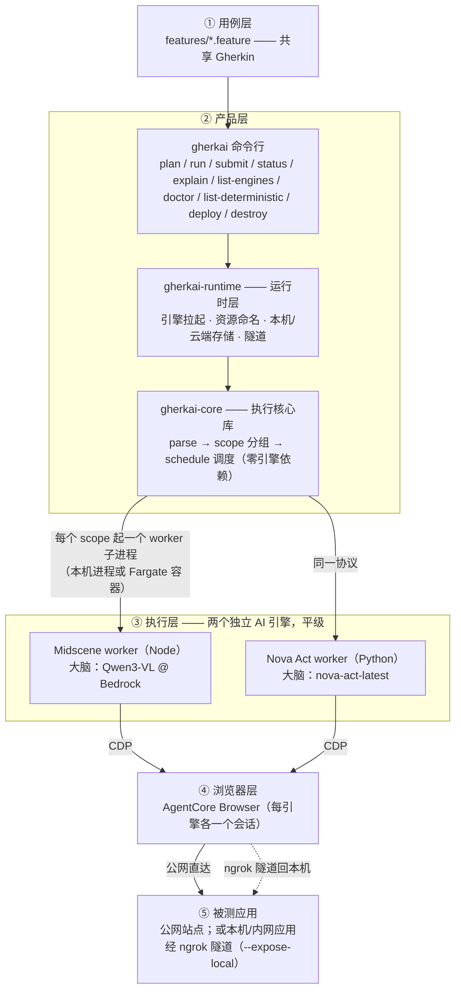

# Gherkin × (Midscene + Nova Act) × AgentCore Browser

**gherkai** 是一个 UI 自动化测试工具：测试用 **Gherkin**（`.feature` 文件）写成人话，交给 **AI 引擎**（Midscene 或 Nova Act，二选一或按用例混用）读懂后，在 **AWS Bedrock AgentCore** 承载的云端浏览器里真跑。

`.feature` 里的一个 step 有两种跑法：

- **交给 AI（默认）**：引擎读自然语言，自己操作页面、自己判断结果，QA 不用写代码。AI 的判断可能抖动，所以断言可以投多票取多数（`--assertion-votes`）。
- **确定性 step**：必须精确的检查（当前 URL、某个 DOM 元素、精确文本）不该让 AI 猜。这类 step 是少数，由测试开发**按需**写成一个小函数放进项目的 `steps/` 目录：函数拿到的是浏览器页面对象（Playwright 的 `page`），直接查、不问 AI、结果可复现；QA 只需在 `.feature` 里照它登记的说法写一句（内建了「页面地址匹配」这类现成锚点，装上即可用）。

## 能做什么

| 能力                | 说明                                                                                                                  |
|---------------------|-----------------------------------------------------------------------------------------------------------------------|
| 双引擎执行          | 同一份 `.feature`，按 `@engine` tag 路由到 Midscene 或 Nova Act；未标走默认引擎                                         |
| 云端浏览器          | 两个引擎都接 AgentCore Browser（每个 scope 一个会话），本机不装 Chromium                                                 |
| 本机 / 云端两档     | `--backend local`：worker 跑本机子进程、结果落 `reports/`；`--backend cloud`：worker 跑 Fargate、状态落 DynamoDB、结果落 S3 |
| 前台 / 后台两种跑法 | `run` 在线守着出结果；`submit` 提交即走、`status --wait` 事后收——cloud 档提交完关机也跑完                               |
| 投票治理            | AI 断言可配 N 次取多数票（`--assertion-votes`）                                                                         |
| 确定性 step         | 项目里的 `steps/` 目录注册精确断言，`plan` 预检标注哪些 step 走确定性、哪些走 AI                                        |
| 机读与自检          | 查询类命令都有 `--json`（plan / run / status / explain / list-* / doctor / deploy list-workers）；`explain` 把失败那一步的 AI 推理与截图指针机读化；`doctor` 一条命令自检环境；`--tags` / `--scenario` 只跑一部分；`--quiet` 把 worker 日志落盘——给脚本与 AI agent 驾驭用 |
| 本机应用测试        | `--expose-local http://localhost:3000` 经 ngrok 隧道把本机可达的应用暴露给云端浏览器                                  |
| 预算兜底            | 每个 job 有墙钟预算（缺省 300s，`@timeout:` tag 可改），卡死/超时自动停、不会计费失控                                      |
| 跨引擎报告          | 每个 run 一份 RunReport（`index.html` 人看入口 + `manifest.json`）                                                      |

## 架构速览



全栈托管在 AWS 内。**被测 UI 的语言**：Midscene 引擎不限（中文 UI 上动作与 AI 断言实测与英文同级可靠）；Nova Act 引擎的支持范围是英文 UI——它在中文页面上能操作、能判页面级语义，但「正文里是否出现某个中文词」这类断言会稳定判否。非英文应用请用 `@engine:midscene` 路由。

## 前置要求

- AWS 凭证（默认 profile 即可），region **us-east-1**，需具备：
  - Bedrock 模型访问：`qwen.qwen3-vl-235b-a22b`（Midscene 大脑）
  - AgentCore Browser（`bedrock-agentcore` 服务）
  - Nova Act 服务（`nova-act`）+ 模型 `nova-act-latest`（所需的 workflow definition 首次运行时自动创建）
- Node ≥22（Midscene worker；`gherkai deploy` 同一下限）、Python 3.13 + [uv](https://docs.astral.sh/uv/)
- （可选，仅 `--expose-local` 需要）[ngrok](https://ngrok.com/download) + authtoken（免费账号即够；`ngrok config add-authtoken <token>`——是 dashboard 上的 **Authtoken**，不是 `cr_` 开头的 API key）

## 谁用它

角色是帽子不是人：本地开发时一个人常同时写被测应用、写对应的 step、build 完自己推，几顶帽子都在头上；团队分工时按下表拆开即可。

| 要做的事                                                    | 角色             | 装什么                                                     | 需要什么                                       |
|-------------------------------------------------------------|------------------|------------------------------------------------------------|------------------------------------------------|
| 写 `.feature`（纯自然语言、零代码），提交、看结果                | feature 作者（QA） | `gherkai`；要在本机跑（`--backend local`）再加下面两个 worker | 写：不需要任何凭证；跑：按跑法，见「上手」开头的表   |
| 写 `steps/` 里的确定性 step，本机验证，build 定制 worker 镜像 | 测试开发         | `gherkai[local]` + `@gherkai/worker-midscene` + docker     | 同上；不需要云端写权限，镜像交给部署方推         |
| 建/改共享的云端后端，推 worker 镜像                          | 部署方           | `gherkai[deploy-aws]` + Node ≥22 + docker                  | AWS 账号的部署权限（CDK、ECR、ECS、SSM）；跑用例同上 |
| 开发 gherkai 本身                                              | contributor      | clone 仓库                                                 | 见 [`DEVELOPMENT.md`](./DEVELOPMENT.md)        |

## 安装

```bash
uv tool install gherkai                     # 只提交云端 run 的人：CLI 本体
uv tool install 'gherkai[local]'            # 本机跑 Nova Act worker（--backend local）
npm i -g @gherkai/worker-midscene           # 本机跑 Midscene worker（Node ≥22；CLI 按 PATH 定位）
uv tool install 'gherkai[deploy-aws]'       # 部署方：gherkai deploy / push-worker（另需 Node ≥22、docker）
uvx gherkai --version                       # 或免安装临时跑（uvx --from 'gherkai[local]' gherkai run …）
pipx install --fetch-python missing gherkai   # 不用 uv 的人：pipx 回落（pipx 默认不下载解释器，本项目要 Python ≥ 3.13；装 extra 写 'gherkai[local]'）
```

版本由 git tag 派生、各包同号锁定；CLI 与已部署后端的版本在 `--backend cloud` 预检时比对，不一致会明确提示怎么办。各包页面：[`gherkai`](https://pypi.org/project/gherkai/)（CLI）· [`gherkai-worker-novaact`](https://pypi.org/project/gherkai-worker-novaact/) · [`@gherkai/worker-midscene`](https://www.npmjs.com/package/@gherkai/worker-midscene) · [`gherkai-deploy-aws`](https://pypi.org/project/gherkai-deploy-aws/) · 库层 [`gherkai-core`](https://pypi.org/project/gherkai-core/) / [`gherkai-runtime`](https://pypi.org/project/gherkai-runtime/)。

## 上手

跑法由**两个正交旋钮**组合出来（四种组合都合法）：

- **怎么跑**——前台 `run`（CLI 在线守着，跑完直接给结果）或后台 `submit` + `status`（提交即走，事后查/收）。
- **跑在哪 / 落在哪**（`--backend`）——`local`（默认：worker 跑本机子进程，结果落本地 `reports/`）或 `cloud`（worker 跑 Fargate 容器，状态落 DynamoDB、结果落 S3；需先由部署方跑 `gherkai deploy --vpc <档> --prefix <前缀>` 建齐资源，见 [`deploy_aws/README.md`](./deploy_aws/README.md)）。

四种组合需要的权限不同、费用记到谁头上也不同；凭证越少的跑法越适合 CI 与低权限机器：

| 跑法                                  | 需要什么                                                                                                                            | 费用记到          |
|---------------------------------------|-------------------------------------------------------------------------------------------------------------------------------------|-------------------|
| `plan`                                | 无凭证（装了 worker 才有确定性 step 标注）                                                                                            | 无                |
| `run` / `submit`，`--backend local`    | 本机 AWS 凭证（见前置要求）+ 两个 worker                                                                                              | 自己的 AWS 账号   |
| `submit` + `status`，`--backend cloud` | 最小云端权限：读写运行记录表、只读探活、调用后端 Lambda（用例含多行参数时还要 S3 写权限）；不需要任何 ECS 写权限，任务由后端的 Lambda 拉起 | 部署方的 AWS 账号 |
| `run`，`--backend cloud`               | 上一档再加起停 Fargate task 与写结果桶的权限（CLI 进程自己起 task、自己上传任务、自己推进）                                             | 部署方的 AWS 账号 |

### ① 先预检（纯本地、零费用）

```bash
gherkai plan features/engine_routing.feature   # 看 scope/job 分组、engine 路由、校验配置；
                                               # 每个 step 标注派发预期：命中确定性 step 的标「← 确定性: <说明>」，纯自然语言步走 AI
gherkai list-engines                           # 列可用引擎（某引擎没装会原地给装法）
gherkai doctor                                 # 一次自检：引擎、steps/ 加载；加 --backend cloud --prefix P 连带查凭证与后端
gherkai plan features/x.feature --tags smoke   # 只看带 @smoke 的 scenario（run/submit 同样认 --scope / --tags / --scenario）
gherkai list-deterministic --engine midscene   # 列该引擎支持的确定性 step（含你项目 steps/ 里的；--json 可选）
```

**先 `plan` 后跑**——真跑会产生真实 AWS 费用（模型调用 + AgentCore 会话），plan 是纯本地预检。

### ② 前台跑：`run`

```bash
AWS_REGION=us-east-1 gherkai run features/engine_routing.feature      # engine 由 @engine tag 选、未标用 --default-engine
AWS_REGION=us-east-1 gherkai run features/wikipedia_generic.feature \
  --default-engine midscene --assertion-votes 3 --max-concurrency 2 --json
```

默认（local）落盘到当前目录 `reports/<run_id>/`（`--report-dir` 可改）：判定真值（`jobs/`）+ 运行状态 + RunReport（`index.html` / `manifest.json`），边跑边写。加 `--backend cloud --prefix <前缀>` 即换云端档（`--prefix` 与部署时一致）。

### ③ 后台跑批：`submit` + `status`

```bash
# local 档：本机起一个脱离 CLI 的后台进程推进——不必守着终端，但本机需保持开机
RUN_ID=$(gherkai submit features/wikipedia_generic.feature)
gherkai status "$RUN_ID"            # 查一眼进度（只读）
gherkai status "$RUN_ID" --wait     # 等到终态、按判定给退出码——CI 要 0/1 判定用这个
gherkai explain "$RUN_ID"           # 有用例没过时看为什么：逐步打出问了 AI 什么、AI 看见了什么、截图在哪（云端档加同一套 --backend/--prefix）

# cloud 档：提交即返回，之后由云端推进——提交完关机也跑完
RUN_ID=$(gherkai submit features/wikipedia_generic.feature --backend cloud --prefix gherkai-)
gherkai status "$RUN_ID" --backend cloud --prefix gherkai- --wait
```

`status` 的 `--backend` / `--report-dir` / `--prefix` 须与 `submit` 时一致。常用选项与退出码见 [`cli/README.md`](./cli/README.md)，全部选项以 `gherkai <命令> --help` 为准。

### ④ 测本地/内网应用：`--expose-local`

```bash
# feature 里照写原始地址 http://localhost:3000；gherkai 起 ngrok 隧道后在提交时替换为公网 URL
# （带每 run 一换的 basic-auth 凭据、run 结束即拆）
gherkai run my_app.feature --expose-local http://localhost:3000
RUN_ID=$(gherkai submit my_app.feature --expose-local http://localhost:3000)
```

`submit` 后隧道由本机后台进程持有——**本机需保持开机联网直到 run 终态**。

### 怎么写 `.feature`（QA 零代码）

- 动作/断言都写**纯自然语言**：`When "搜索 OpenAI"` / `Then "进入了 OpenAI 词条页"` → 默认走 AI（断言按投票取多数）。
- scope / 引擎 / 超时预算用 **tag**：`@scope:login`（同 scope 共享会话、串行）/ `@engine:midscene|novaact` / `@timeout:120`（该 scope 的墙钟预算秒）。
- **确定性精确检查**（URL/DOM，不容 AI 抖动）：测试开发在项目的 `steps/` 目录注册（Nova Act 用 `*.py`、Midscene 用 `*.mts`，同一正则两侧对称），命中走精确判定、不投票；写法见 [`engines/novaact/README.md`](./engines/novaact/README.md) / [`engines/midscene/README.md`](./engines/midscene/README.md)。CLI 按 `--steps-dir` > 环境变量 `GHERKAI_STEPS_DIR` > `./steps` 找到它；任一文件加载失败即拒绝运行。云端跑时 steps 烙进 worker 镜像的 variant，见 [`deploy_aws/README.md`](./deploy_aws/README.md)。
- **多行参数**：AI 动作/断言 step 可挂 DataTable / DocString，随 step 一起喂 AI。
- **非英文 UI**：给 scenario 标 `@engine:midscene`（或 `--default-engine midscene`）。AI 断言写成直白的语义陈述（「当前是 X 的词条页」「页面没有报错」），别把段落边界、子串规则塞进断言——那是确定性 step 的活。中文探针见 [`features/wikipedia_zh.feature`](./features/wikipedia_zh.feature)。

示例 feature 在 [`features/`](./features/)。

## 注意

- 运行会真实消耗 AWS 费用（模型调用 + AgentCore 会话）。
- 生产用途前先用 `plan` 与骨架用例（wikipedia / example.com）确认环境与凭证。

## 深入了解

- 术语表：[`CONTEXT.md`](./CONTEXT.md)
- 机制解读（给人读的横切文档）：[`docs/guides/`](./docs/guides/)
- 架构决策记录：[`docs/adr/`](./docs/adr/)；外部一手来源：[`docs/REFERENCES.md`](./docs/REFERENCES.md)
- **参与开发**：[`DEVELOPMENT.md`](./DEVELOPMENT.md)（目录结构、开发环境、测试、发布），各包目录另有各自的 `DEVELOPMENT.md`；项目约定见 [`CLAUDE.md`](./CLAUDE.md)
