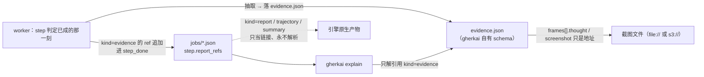

# 产物与证据地理：跑完了东西在哪、哪一份答哪个问题（local × cloud）

> **文档定位（读前必知）**：本文是给**人**（使用者 / contributor / operator）读的跨 ADR 合成导览——只讲**东西落在哪、哪一份该拿来回答哪个问题**（how），不复述决策理由与权衡（why 全在各 ADR，本文只给指针）。**权威永远在 ADR 与 code**，与本文冲突时以它们为准。为什么有这一层：一次 run 的产出横跨五个不同职责的载体（本地文件 / S3 / DynamoDB / CloudWatch / 引擎 SDK 自己的目录），每个载体的决策各归一个 ADR，而「排障时该打开哪个文件」这个问题的答案要把它们拼起来才有。（本层的维护判据见 [CLAUDE.md](../../CLAUDE.md)「文档纪律」guides 条）

## 1. 五类东西，各答一个问题

一次 run 产出的东西按**职责**分五类。分类比目录结构更重要——同一个目录里既有真值也有派生视图，混读就会拿派生视图当判定源。

| 类别 | 是什么 | 回答的问题 | 落在哪（见 §2） | 能不能删 |
|---|---|---|---|---|
| **definition** | 提交时定死的 run 定义（run_id / created_at / 并发 / 每个 job 的 scope·engine·scenario·step 原文·timeout） | 「这次到底提交了什么」 | `run_meta.json` / runs 表 `META` item | 不能（是判定树的骨架） |
| **运行态** | 控制面投影：run 级 status、各 job 的 status·session_id·claimed_at，以及事件水位（只有经推进器投影过的 run 才有这一项） | 「现在跑到哪了 / 提交了没」 | `run_state.json` / runs 表 `STATE` item | 可（能从判定真值重建） |
| **判定真值** ★ | 每个 job 一份自包含的判定明细：job→scenario→step 的 status·votes·error_type·message·duration + 全部产物指针 | 「结果到底是什么、为什么」 | `jobs/<urlencode(scope_id)>.json` | **不能**——这是唯一权威 |
| **派生导航** | `manifest.json`（机读扁平产物清单）+ `index.html`（判定明细树 + 每条产物一行链接，含锚点回跳） | 「人从哪一眼看进去」 | 同 run 目录 | **可删可重建，永不作判定源** |
| **现场证据** | 引擎原生产物（Nova trajectory `.html`+`_trajectory.json`、`session_summary.json`；Midscene `report/` 下那份 HTML（文件名由 SDK 生成、含时间戳，别按固定名找）+ `report/screenshots/`）＋ gherkai 自有的 step 级 `evidence.json` 与它引用的截图 | 「那一步模型看见了什么、怎么想的」 | 各引擎产物子目录下（见 §2） | 可（但删了排障就只剩状态码） |

三条推论，排障时最常用：

- **判定看 `jobs/*.json`，不看 `index.html`**。`index.html` 里那棵判定树是从内存 `RunResult` 渲染的**派生视图**；`manifest.json` 甚至不含判定（只有薄信封 + 扁平产物清单，靠 `run_id` 软引用回判定真值）。CI 判定读退出码或 `jobs/*.json`。
- **`run_state.json` 落后于 `jobs/*.json` 是正常的**：写序是「数据面先、控制面后」，读到 run 级终态即保证各 job 判定明细已齐；反之若两者不一致，以 `jobs/*.json` 为准。
- **原始产物指针（`ref`）的权威落盘处只有 `jobs/*.json`**。`manifest.json` 每条只留 `href`（导航链接）、不留 `ref`——要机器读原始指针，去判定真值取，不向派生视图要。

> 权威：[ADR 0016](../adr/0016-execution-architecture-core-lib-run-model.md)（三层 port 切分：RunStore 控制面 / ResultStore 数据面 / ReportStore 派生视图）、[ADR 0027](../adr/0027-runreport-aggregation-index.md)（RunReport = 归集索引、manifest/index.html 形态、`href` 不含 `ref`）、[ADR 0030](../adr/0030-realtime-persistence-seam.md) 决定三（commit point 写序与失败语义）；字段逐个的含义见 [`./cli-json-contract.md`](./cli-json-contract.md)（本文不重复字段表）。

## 2. 物理地理：local 与 cloud 是同一棵树的两种载体

**关键对称**：cloud 的 S3 key **按相对 run 目录的路径镜像 local 的树**——两个 worker 上传器都把「产物本地绝对路径」减去「本地 run 树根」得到相对路径，再拼 `<report_dir>/<run_id>/` 前缀成 key（`keyFor` / Nova 侧同规则）。所以你在本机看到的相对位置，在 S3 上就是同一个相对位置。

```
local：  <--report-dir>/<run_id>/            cloud：  s3://<bucket>/<report_dir>/<run_id>/
├─ run_meta.json      definition            ├─ （不在 S3）→ runs 表 item run_id=<id>, item_type=META
├─ run_state.json     运行态                 ├─ （不在 S3）→ runs 表 item run_id=<id>, item_type=STATE
├─ jobs/<enc>.json    ★判定真值              ├─ jobs/<enc>.json          同形同名
├─ manifest.json      派生                   ├─ manifest.json            同形同名
├─ index.html         派生入口                ├─ index.html               同形同名
├─ nova-trajectories/ Nova 产物              ├─ nova-trajectories/…      key 镜像相对路径
│  ├─ <session_id>/  act_*.html + act_*_trajectory.json + session_summary.json │
│  └─ evidence/<scenario 键>/step-<n>/       │  └─ evidence/…/step-<n>/evidence.json + act-<i>-frame-<j>.jpg
├─ midscene-run/      Midscene 产物          ├─ midscene-run/…           key 镜像相对路径
│  ├─ report/*.html + report/screenshots/    │
│  ├─ log/                                   │
│  └─ evidence/<scenario 键>/step-<n>/evidence.json
├─ worker.log         仅 --quiet ∧ 本机执行   ├─ （无此文件）→ CloudWatch 日志组 /<prefix>worker/<engine>
├─ reconcile.log      仅 local submit         ├─ jobs-in/                 job 输入 JSON（不是判定，别读混）
├─ events.db          仅 local submit         ├─ args/                    docString/dataTable 正文（一律 offload、无 size 阈值）
├─ tunnel.json        仅 local submit ∧ --expose-local  └─ （事件在 events 表，不在桶里）
└─ .runstate.lock     run_state 写面互斥
```

几处容易踩的不对称：

- **Nova 的 per-act 文件与 session 汇总同在 `nova-trajectories/<session_id>/`**（这一层由 SDK 用会话 id 建，`session_id` 在 `jobs/*.json` 的 job 层有、排障可直接 `ls` 过去）：每次 act 一组 `act_<序号>_<指令片段>.html` + 配套 `_trajectory.json`（act 抛错时配套 json 通常没写、只剩 `.html`），另有 SDK 自己的 trace/log 文件；`session_summary.json`（`kind=summary`）只在这个 scope 真调过 AI 时才写。Midscene 侧 `report/` 除 `*.html` 与 `screenshots/` 外，还有每个 execution 一份的 `<n>.execution.json`（截图落成独立文件的连带产物，同样只在真调过 AI 时才有），随整目录 flush 一并上传。**确切文件名别照猜**（名字里嵌指令片段、且随 SDK 版本漂）——顺判定真值里那条 `ref` 走。
- **`jobs/` 与 `jobs-in/` 只差三个字母，语义相反**：`jobs/` 是判定输出（ResultStore 枚举它），`jobs-in/` 是 cloud 起 task 时放的 job 输入。前缀故意分开，就是为了不撞 key、不被当判定读。
- **cloud 的 `run_meta` / `run_state` 不在桶里**，`--json` 的 `artifacts` 给的是 `ddb://<表>/<run_id>#META` 形式的**诊断指针**（纯展示、不被任何代码解析）。
- **cloud 档本机通常没有这棵本地树**：产物写在容器内 `/tmp/gherkai-run/<run_id>/` 下的同名子目录里，上传成功即删本地、随容器盘销毁。run 收尾时组合根仍对本机 `<report-dir>/<run_id>/` 做一次「只删空目录」的清理（目录不存在则 no-op；上传失败保留了产物的目录非空、自然不删）。
- **`--no-report` 不落 definition / 运行态 / 判定明细 / 报告，也不产引擎产物与 evidence**（经 `GHERKAI_NO_ARTIFACTS=1` 告知 worker），local 与 cloud 同律；此档 `<report-dir>/<run_id>/` 下什么都不落，真正还会落盘的只在系统临时目录、worker 既不收集也不上报：Nova Act SDK 关不掉 trajectory（不传 `logs_directory`，SDK 写进自己 `mkdtemp` 的目录）、Midscene SDK 的 log/dump（无 `MIDSCENE_RUN_DIR` 时 worker 把落点导去一次性临时目录，免得进用户 CWD），以及 local 档 `--quiet` 的 worker 日志（`<tmpdir>/gherkai-worker-<run_id>.log`）。
- 引擎产物的落点是**注入**给 worker 的（`NOVA_LOGS_DIR` / `MIDSCENE_RUN_DIR`），S3 上传落点是另一对注入（`ARTIFACT_S3_BUCKET` / `ARTIFACT_S3_PREFIX`）。worker 对「我在哪跑」无知，只认注入了没有：注入了就传 S3 报 `s3://`，没注入就报 `file://`。

> 权威：[ADR 0029](../adr/0029-engine-artifacts-to-s3.md)（worker 上传、S3 key 镜像 run 树、删本地与空壳清理）、[ADR 0027](../adr/0027-runreport-aggregation-index.md)（两引擎落点归位到 run 目录、`href` 相对化）、[ADR 0030](../adr/0030-realtime-persistence-seam.md) 决定六（DDB 两 item、`jobs/` key 布局、argument offload）、[ADR 0037](../adr/0037-distribution-and-packaging.md) 决策 3（`--no-report` = 真不生成）、[ADR 0042](../adr/0042-step-evidence-and-explain.md) 决策一（evidence 落引擎产物目录内、`<scenario 键>` 派生）。云端资源本身（表 / 桶 / 日志组 / 命名与权限）见 [`./cloud-backend-carriers.md`](./cloud-backend-carriers.md)。

## 3. 证据链怎么串起来



四件事把这条链钉住：

1. **谁产**：worker，在 step 结束那一刻——那时它手里才有引擎的材料（Nova 是刚写盘的 trajectory json，Midscene 是内存里的 `agent.dump.executions`）。不是 CLI 事后去解析 SDK 产物。
2. **只解引用 `kind=="evidence"`**：`explain` 拿到 step 的 `report_refs` 后只挑 `kind=="evidence"` 那条读（`_explain_read_evidence`），其余 `report` / `trajectory` / `summary` **只当链接原样搬出**。判据是「内容是不是我们自己定义的 schema」——引擎原生格式随 SDK 版本漂，解析它等于把引擎知识搬进 CLI。读字节的唯一入口是 `compose.read_resource`（`file://` 复用 report_store 的 URI→路径解析，`s3://` 走 `get_object`）。
3. **截图只给地址、不内嵌图**：`frames[].screenshot` 是 `file://` 或 `s3://` URI。URI 用上传器的同一套 key 规则**确定性算出**后就写进 `evidence.json`，字节则在 `step_done` 发出**之后**交后台队列上传——判定不被网络拖住，字节多半在下个 step 跑完前就到了。
4. **文本形态是摘要，不是全文**：`explain` 默认每个 act 只渲染最后一个带 `thought` 的 frame（超长推理截断并指回 `--json` 或那份 `evidence.json`），其余 frame 只报个数；`--full` 关掉预算、`--all` 也展开 passed step。文本里的 key 与 `--json` 字段名逐字相同，读文本再对 JSON 不需要翻译。

> 权威：[ADR 0042](../adr/0042-step-evidence-and-explain.md)（决策一 evidence schema 与两引擎映射表、决策二 best-effort、决策四 `explain`、决策五「解引用许可按层收窄」）、[ADR 0027](../adr/0027-runreport-aggregation-index.md)（`ReportRef` 三元组、core 对它永久不透明搬运）。字段与取值全集见 [`./cli-json-contract.md`](./cli-json-contract.md)。

## 4. 一次失败，按三步读

```
① gherkai status <run_id> --wait        → 等到终态；终态时它把报告 / 运行元信息 / 判定明细的位置打出来
② gherkai explain <run_id> [<scope_id>] → 哪一步、问了什么、模型看见什么、为什么这么判（默认只展开非 passed）
③ 打开 ①/② 给出的 index.html 或原生产物链接 → 引擎自己的报告页 / 轨迹页 / 截图，看现场
```

`status` 与 `explain` 的退出码语义不同：判定码由 `run` 与 `status` 给——`status` 只在读到终态时才表判定（`passed`→0、其余终态→1；未达终态退 0，故 CI 拿判定要用 `status --wait`），**`explain` 只用 0 / 2**（0 = 渲染成功，哪怕一条证据都没有；2 = 参数错 / run 或 scope 不存在 / 云端不可用），别拿它判红绿。detached run 未到终态时判定明细还没落地，`explain` 会打一行「先用 `status --wait`」并退 0。

**看到这个提示 → 它在说什么**（文本形态；机读侧对应 `record_missing` / `evidence_missing` / `aborted_hint`）：

| 看到的 | 它在说 | 该怎么办 |
|---|---|---|
| `无 AI 证据` | 这一步有判定记录，但没有 `kind=evidence` 的指针。三种可能在这里**分不出来**：确定性 / 导航 step 本就不产、AI 跑了但抽取失败、这一步压根没记录 | 要区分「没跑」和「跑了没产证据」看 `record_missing`；确定性 step 为何天生不产见 [`./deterministic-step-lifecycle.md`](./deterministic-step-lifecycle.md) |
| `无记录（未执行或未上报）` | 骨架（job 定义）里有这一步，判定明细里没有它——worker 被外部中止时，没跑完的 scenario 不进判定明细 | 看同一 scope 的 job 级判定块与 worker 日志；这一行不代表「这步失败了」 |
| `本 job 被中止，部分已执行 step 的证据未进判定记录` | 这个 job 终态是 aborted 或 error，且只有**部分** step 有记录。已执行 step 的 evidence **已经产出并上传了**，但它的指针只留在事件记录里、没进判定明细 | 顺 `index.html` / job 级 `report_refs` 找引擎原生产物；证据文件本身按 §2 的 `evidence/<scenario 键>/step-<n>/` 路径也能直接翻到 |
| `AI 证据的格式版本这个版本的 gherkai 认不出（升级后再看）` | `evidence.json` 的 `schema_version` 不是当前 CLI 认识的那个 | 升级 CLI；产物没坏 |
| `AI 证据读不到（文件不在或内容已损坏）` | 指针在，但按它取不到字节（对象不存在 / 无权限 / 不是 JSON） | cloud 档先核 `--prefix` / `--report-dir` 与凭证；若是 worker 被硬杀的 run，见 §5 最后一条 |
| 一段 `判定：<status>` + `诊断细节见 worker 日志` | 这个 job **一条 step 记录都没有**（worker 没起来、或起来就被掐） | 去 worker 日志（local `--quiet` 档 = `worker.log`，cloud = CloudWatch 日志组） |

> 权威：[ADR 0042](../adr/0042-step-evidence-and-explain.md) 决策四（记录缺口的两种情形、退出码只用 0/2、文本预算）、[ADR 0031](../adr/0031-job-lifecycle-states-and-severity.md)（各 job / step 状态的含义与短路旁注）。判定语义本身（各态怎么聚合、`shortcircuited` 判据）见 [`./verdict-model.md`](./verdict-model.md)；`--wait` 谁在推进、超时怎么算见 [`./execution-and-reconciliation.md`](./execution-and-reconciliation.md)。

## 5. 诚实的边界（都是有意接受的取舍，不是遗漏）

| 现象 | 为什么 | 指针 |
|---|---|---|
| **纯确定性 run 的产物清单是空的**，`index.html` 显示「本次 run 无报告产物」 | 引擎原生产物只在真调过 AI 时才产生（Nova 的 trajectory 要有 act、Midscene 的 report 要调过 agent），确定性 step 走页面 API、从不调引擎；evidence 同理。**判定一点不少**——每个确定性 step 的 pass/fail/error 与时长都在判定真值里 | [ADR 0027](../adr/0027-runreport-aggregation-index.md)「纯确定性用例 → 空 report_index」（含「跑后看不见那一步做了什么」这个仍敞着的口子） |
| **cloud 档没有 `worker.log`** | worker 在容器里跑，日志由 task 的 log driver 进 CloudWatch 日志组 `/<prefix>worker/<engine>`（stream 前缀 = 引擎名）。`--json` 的 `artifacts` 里因此**不出现** `worker_log` 键——它只在 `--quiet` 且本机执行时出现 | [ADR 0041](../adr/0041-agent-facing-cli-affordances.md) 决策二（`--quiet` 的落点）；日志组名不经 `names.py`、由 stack 建 task-def 时定（真值 = `deploy_aws/gherkai_deploy_aws/stack.py` 里 worker container 的 `LogDriver.aws_logs`：`log_group_name` = `/<prefix>worker/<engine>`、`stream_prefix` = 引擎名） |
| **`--no-report` 下 `<report-dir>` 什么都不落** | 它的含义就是「不生成产物」，不是「落到别处」：不注入落点 + `GHERKAI_NO_ARTIFACTS=1` 令 worker 不生成、不上报；cloud 档同注此 env，因此也没有 S3 上传 | [ADR 0037](../adr/0037-distribution-and-packaging.md) 决策 3（含「落系统临时目录」这个被拒方案及其理由） |
| **被中止的 job，`explain` 只给一行提示、给不出它已产的 evidence** | 没跑完的 scenario 不发 `scenario_done`，其 step 记录不进判定明细，evidence 指针**只留在事件记录里**；而 `explain` 按设计只读判定明细、不读事件流 | [ADR 0042](../adr/0042-step-evidence-and-explain.md)「已知缺口与重议闸门」（含触发信号与预案：给 core 开事件流读接缝） |
| **cloud 档某张截图的 URI 偶尔取不到对象** | 截图 URI 是确定性算出来的、字节由后台队列随后上传；进程被**硬杀**（SIGKILL / 容器被收）时最后一个 step 在途的一两张可能没到。正常路径与收尾的有界排空已真跑覆盖到「中途被掐也不丢」 | [ADR 0042](../adr/0042-step-evidence-and-explain.md)「截图字节的残余风险」、[ADR 0032](../adr/0032-fargate-execution-environment.md)（容器盘停即销毁、grace 组成、孤儿产物 reaper 为何否决） |
| **报告写失败不会让 run 变红** | RunReport 是纯派生视图、可重建，故它的写在 commit point **之后**、异常被隔离；此时 `run --json` 的 `artifacts` **省略** `report_index` 键，人读档收尾行打「报告: <报告写入失败，已跳过；判定结果不受影响、仍已落库>」。`status` 不同：它给的是**约定落点**（写成没写成都照打、`--json` 的 `artifacts` 也恒含 `report_index`），不提写失败 | [ADR 0030](../adr/0030-realtime-persistence-seam.md) 决定三 |
| **`jobs/*.json` 里的 `ref` 是绝对路径，报告目录整拷到别的机器后那些链接会断** | 自包含只做到「半可移植」：`index.html` / `manifest.json` 的 `href` 相对化（可整目录搬走），判定真值里的 `ref` 保持绝对（provenance）。跨机器分享用 `index.html`，或直接用 cloud 档（全在 S3、`s3://` 全局可寻址） | [ADR 0027](../adr/0027-runreport-aggregation-index.md)「被拒方案：不做 materialize 式产物拷贝」 |

> 权威：上表每行的 ADR 指针即该条的权威；跨条的共同前提是「判定真值 > 报告产物」这条优先级（[ADR 0029](../adr/0029-engine-artifacts-to-s3.md)）与「派生视图可重建、永不作判定源」（[ADR 0027](../adr/0027-runreport-aggregation-index.md)）。

## 6. 延伸阅读

| 想深入的主题 | 去哪读 |
|---|---|
| 每个字段的类型与出现条件（`run` / `status` / `explain` / `evidence` 全集） | [`./cli-json-contract.md`](./cli-json-contract.md) |
| 谁在推进、事件走哪条物理通道、超时怎么兜底、诊断落哪 | [`./execution-and-reconciliation.md`](./execution-and-reconciliation.md) |
| 各判定态的语义与聚合规则、短路与严重度 | [`./verdict-model.md`](./verdict-model.md) |
| 确定性 step 为什么不产产物、它的注册与发现 | [`./deterministic-step-lifecycle.md`](./deterministic-step-lifecycle.md) |
| 云端载体本身：两张表、桶、日志组、命名与权限面 | [`./cloud-backend-carriers.md`](./cloud-backend-carriers.md) |
| RunReport 的语义与扩展性契约（新引擎零改 core） | [ADR 0027](../adr/0027-runreport-aggregation-index.md) |
| evidence schema、两引擎映射表、SDK 漂移防线 | [ADR 0042](../adr/0042-step-evidence-and-explain.md) |
