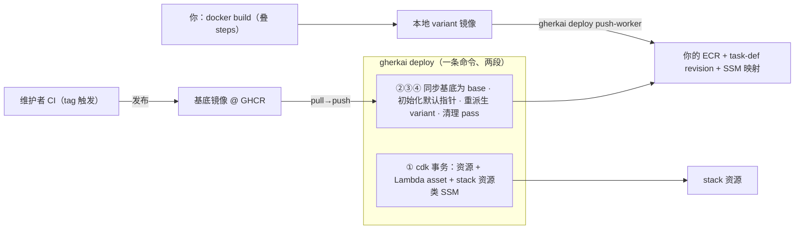

# 云端后端由哪些载体拼成：一次改动要传播到哪几处才生效

> **文档定位（读前必知）**：本文是给**人**（部署方 / operator / contributor）读的跨 ADR 合成导览——只讲**机制如何协同工作**（how），不复述决策理由与权衡（why 全在各 ADR，本文只给指针）。**权威永远在 ADR 与 code**，与本文冲突时以它们为准。为什么有这一层：`--backend cloud` 的后端不是一个整体，而是五个各自独立更新的载体拼出来的，而这件事在任何单个 ADR 里都只露出自己那一角——「我升了版本 / 改了东西，为什么云端没变？」的答案要横切 0033 / 0037 / 0038 / 0034 / 0042 才拼得出来。（本层的维护判据见 [CLAUDE.md](../../CLAUDE.md)「文档纪律」guides 条）

本文只答「改动要落到哪几处」。**推进链本身**——谁在推 run、事件走哪条通道、超时怎么兜、云端 Lambda 为什么不抢前台 run——见 [`execution-and-reconciliation.md`](./execution-and-reconciliation.md)，本文不重复。

## 1. 五个载体

| 载体 | 装什么 | 谁改它 | 什么时候生效 | 名字/真源 |
|---|---|---|---|---|
| **CloudFormation stack** | 全部资源与其形态：runs 表（另带 `status-index` 稀疏 GSI）与 events 表（另带 TTL），两表都开 Stream；artifacts 桶（含 job-in 的按 tag 过期规则）；ECS cluster；每引擎一个 **task-def 模板 revision** 与一个 ECR repo；三个 Lambda + EventBridge rule + 两条 Stream 事件源；IAM 角色；VPC/子网/安全组；以及随事务写的几族 SSM 参数 | `gherkai deploy`（拼 context → cdk CLI 起 `gherkai_deploy_aws.app` 合成 → `cdk deploy`） | 变更集应用完即生效；**回滚时随事务一起回滚**（戳与模板不留错值） | stack 名 = `names.stack_name(prefix)`（provider 专有，与 `LAMBDA_ASSET_DIR_ENV` 同住 `deploy_aws/gherkai_deploy_aws/names.py`）；云资源名全经 `gherkai_runtime.names` 由 `--prefix` 推导 |
| **三个 Lambda 的部署 asset** | `lambdas/` 的 handler 源（`reconciler.py` 一份两个入口 + `exit_observer.py`）+ `BackendStack.LAMBDA_ASSET_PACKAGES` 逐项**从当前 venv 已安装位置复制**的 import 包（含 `gherkai_core` / `gherkai_runtime`）。boto3 由 Lambda runtime 自带 | 同一条 `gherkai deploy`（asset 由 `stack._build_lambda_asset()` 现摊到临时目录） | asset 内容变 → CDK 算出的 asset hash 变 → 这次 deploy 的变更集里就带三个函数的代码更新 | `stack.BackendStack.LAMBDA_ASSET_PACKAGES`；落点经 env `names.LAMBDA_ASSET_DIR_ENV` 从命令进程传给 cdk 起的 app 进程 |
| **官方基底镜像** | 同版本 worker 包 + SDK 运行时 + 协议层，**零使用方内容**（`engines/*/Dockerfile`） | 维护者 CI 按 tag 发到 GHCR（`workers.GHCR_BASE_IMAGE`） | GHCR 上就位**之后**，还要 `gherkai deploy` 第 2 步 pull→push 进你自己的 ECR 才在云端可用——**运行时不直连 GHCR** | `ghcr.io/…/gherkai-worker-<engine>:<版本>` |
| **使用方的 variant 镜像** | 基底 + 你 `COPY` 进去的确定性 step 目录（`GHERKAI_STEPS_DIR`）——**云端跑哪套 step 由镜像决定**，不由提交侧 `--steps-dir` 决定 | 你自己 build（gherkai 不拥有构建）+ `gherkai deploy push-worker`（推 ECR、从模板注册 revision、写 SSM 映射） | 写完 SSM 映射后，**下一次提交**解析到新 revision；已在跑的 run 不换（见 §5） | ECR tag = `names.image_tag(CLI 版本, variant)`；repo 名 = `names.ecr_repo_name` |
| **SSM 参数** | `version`（后端版本戳）、`vpc`（生效 VPC 档）、`worker-template/<engine>`（模板 revision ARN）、`subnets`/`security-groups`——这四族是 **stack 资源**；`worker-image/<engine>/<tag>`（映射 JSON）、`worker-default`（默认 variant 指针）——这两族由命令 `put_parameter` 写 | 前四族随 cdk 事务；后两族由 `push-worker` / `deploy` 的第 2–4 步写 | `put_parameter` 即生效（**覆盖语义、最后写者赢**） | 路径全经 `names.ssm_path(prefix, key)`，键名常量在 `gherkai_runtime.names` |



三条容易踩的载体边界：

- **模板 revision 与 variant revision 是两回事**：模板由 stack 建（承 cpu/memory/两个 role/日志组/`runtimePlatform`/`stopTimeout`），镜像栏是 `latest` 占位、**永不被 RunTask**；每个（引擎，variant）另有一个从模板复制、镜像栏换成 `repo@sha256:<digest>` 的 revision，那才是真正起 task 用的。
- **数据类资源不随 `gherkai destroy` 删**（两表、桶、两个 ECR repo 都是 `RETAIN`）；而 `worker-image/*` 与 `worker-default` 不是 stack 资源（由命令 `put_parameter` 写），`destroy` 也不带走它们——同 prefix 重建后这两族参数原值仍在，记的还是上一套 stack 时期的 revision / 模板 ARN。
- **asset 的来源是「发起这次部署的那个 venv」**，不是仓库相对路径、也不联网装——所以 dev 版部署得到的就是你本地那份 code，而漏一个传递依赖的后果是 Lambda 运行期 `ImportError`（清单完整性由 `deploy_aws/tests/test_lambda_asset.py` 的「剥掉 site-packages 真 import」那条守）。

> 权威：[ADR 0033](../adr/0033-iac-aws-backend-and-composition-wiring.md)（资源清单/两层命名/IAM/preflight）、[ADR 0037](../adr/0037-distribution-and-packaging.md) 决策 6（部署形态、asset 来源、版本戳、VPC 档）、[ADR 0038](../adr/0038-worker-image-delivery.md)（概念模型、SSM 参数真源表）；code：`deploy_aws/gherkai_deploy_aws/stack.py`、`.../cli.py`、`.../names.py`（provider 专有名：stack 名 / asset 落点 env）、`runtime/gherkai_runtime/names.py`（共享命名纯函数）。

## 2. 行为住在哪个载体上（动手前先定位）

| 你改的东西 | 住在哪个载体 | 不推它的后果 |
|---|---|---|
| `core` 的判定/投影/序列化（`jobs/*.json` 的字段、状态聚合、RunReport 形态） | **前台 `run`**：提交者本机的 CLI；**`submit`**：Lambda asset 里那份 `gherkai_core`（云端 `jobs/*.json` 由 reconciler 投影产出） | 本机 `run` 立刻有、云端 `submit` 没有——同一次改动在两条路径上表现不一致，最像 bug 的一类 |
| `runtime` 的组合根装配（`build_fargate_engines` 的 job-in 前缀、注入的 env、container 名） | 同上：本机 CLI + Lambda asset | 前台 cloud run 与 detached submit 起出来的 task 形态分叉 |
| worker 侧的 step 执行、证据抽取、收尾排空、确定性 step 注册表 | **worker 镜像** | 云端跑出来就是旧行为（例如没有 `kind=evidence` 的证据），本机 `run --backend local` 却是新的 |
| 你自己写的确定性 step | **worker 镜像**（烙进去，云端不读提交侧 `--steps-dir`——给了只警告不拦） | 云端仍跑镜像里那套旧 step |
| 资源形态：cpu/memory、`stopTimeout`、日志保留、GSI、Stream filter、IAM | **stack** | 资源没变；且已有 variant 的 revision 仍是旧模板派生的（见 §4「重派生」条） |
| 部署侧 per-run 并发 cap、产物前缀 `REPORT_DIR`、子网/安全组 | **stack**（两个推进器 Lambda 的 env；cap 常量 = `BackendStack.DEPLOY_SIDE_MAX_CONCURRENCY`） | 提交侧 preflight 会当场提示：超 cap 只警告，`REPORT_DIR` 不一致直接退 2 |
| 后端版本戳、默认 variant 指针 | **SSM** | 提交侧 skew 判定失真 / 默认 variant 解析不到（见 §4） |

> 权威：[ADR 0042](../adr/0042-step-evidence-and-explain.md)「交付链」条（同一个改动的两条交付路径：Lambda asset vs worker 镜像）、[ADR 0037](../adr/0037-distribution-and-packaging.md) 决策 4（steps 目录约定）、[ADR 0034](../adr/0034-detached-batch-reconciler.md) 机制四（cap 归部署方）；step 集怎么被发现与命中见 [`deterministic-step-lifecycle.md`](./deterministic-step-lifecycle.md)，证据落点见 [`artifacts-and-evidence.md`](./artifacts-and-evidence.md)，`--json` 字段清单见 [`cli-json-contract.md`](./cli-json-contract.md)。

## 3. 一次版本升级的传播顺序，以及为什么不能倒过来

```
① uv tool upgrade gherkai            # 升 CLI（[deploy-aws] extra 沿用）
② gherkai deploy                      # stack + Lambda asset + 新版本基底同步成 base + 重派生 + 清理
③ gherkai deploy push-worker …        # 有自定义 variant 的：从新版本基底重 build 再推
```

**为什么只能这个方向**：后端由 CLI 的 `[deploy-aws]` extra 部署，戳的值就是**发起这次部署的那个 CLI 的版本**（皮把 `args.version` 交给 provider，provider 拼成 `-c version=`，stack 的 `_resolve_version` 缺它即 fail-fast、不回落本包自报版本）。所以「先升后端再升 CLI」在物理上不可执行——deploy 命令自己就是那份 CLI。

**①→② 之间提交会被拒，这是预期**：提交侧四个 cloud 入口（`run` / `submit` / `status` / `explain`）都先过 `compose.check_backend_skew`，CLI 新于后端 → `SKEW_BLOCK` → 退 2、**无放行口**；等 ② 跑完即恢复。不想动本机安装的部署方可以 `uvx --from 'gherkai[deploy-aws]==X.Y.Z' gherkai deploy` 先把后端升上来。

**③ 不能提前到 ② 之前**：镜像 tag 含 CLI 版本（`names.image_tag`），先推就是推进一个后端还不解析的版本命名空间。`push-worker` / `list-workers` 自己带同一道 skew 闸（`workers._skew_gate`）挡住这件事——CLI 新于后端时退 2，并点明「不放行的理由」；`gherkai deploy` 的四步**有意不做**这道前置（它就是改戳的那个动作，前置在 cdk 前会把自己拦死、在 cdk 后恒真）。

**② 里的顺序也是定死的**：第 1 步（登记模板 revision ARN 进 SSM）是 **stack 资源**、随 cdk 事务；第 2/3/4 步在 cdk 之后跑。故 cdk 成功而后三步失败 → 退 **1** 且提示「stack 已生效；重跑 `gherkai deploy` 幂等收敛」——压成 2（= 什么都没发生）会误导。

操作步骤与命令样例不在本文重复，见 [`deploy_aws/README.md`](../../deploy_aws/README.md)「版本与升级」与「worker 镜像」两节、以及 [`cli/README.md`](../../cli/README.md)「CLI 要和后端同版本」。

> 权威：[ADR 0037](../adr/0037-distribution-and-packaging.md) 决策 7（版本单旋钮、skew 三态与操作规则）、[ADR 0038](../adr/0038-worker-image-delivery.md)「与版本升级的交互」「命令族」；code：`runtime/gherkai_runtime/compose.py` 的 `check_version_skew` / `check_backend_skew`、`deploy_aws/gherkai_deploy_aws/workers.py` 的 `_skew_gate` / `run_deploy_steps`。

## 4. 症状 → 该推哪个载体

| 症状 | 缺的那一步 | 判据在哪 |
|---|---|---|
| 任何 cloud 命令直接退 2「本机 CLI 新于后端」 | ② 没跑（stack 没重部署 → 戳还是旧的） | `compose.SKEW_BLOCK` 分支 |
| 云端 `submit` 的判定明细缺新字段（如 step 级 `message`），同版本本机 `run` 却有 | ② 没跑（**Lambda asset** 没重传——云端 `jobs/*.json` 是 asset 里那份 `gherkai_core` 投影出来的） | [ADR 0042](../adr/0042-step-evidence-and-explain.md)「交付链」条 |
| 云端跑完没有证据 / step 行为还是旧的 | ③ 没跑（**worker 镜像**没重推；发行版走 ② 的基底同步，dev 树走 `push-worker`） | 同上 |
| 退 2「默认 variant `X` 在新版本尚无镜像」 | ③ 没跑。**默认指针不随升级重置**（它记的是团队意图，`init_default_pointer` 已存在则不动）——指针还指着 `X`，而 `<新版本>-X` 还没推 | `workers.init_default_pointer`；提示语在 `compose._variant_miss_hint` |
| 退 2「读不到 worker task-def 模板（SSM `worker-template/<engine>`）」 | 本 prefix 从未 `gherkai deploy` 过（或上次部署的 CLI 版本还没有镜像机制） | `workers._template_arn` |
| `deploy` 调了 cpu / `stopTimeout`，可 variant 还跑旧配置 | ② 的第 4 步（重派生）没跑完——revision 是不可变快照、无继承 | `workers.rederive_variants`（按模板 ARN 判定、幂等；`pushed_at` 保留原值，镜像一个字节不动） |
| 提交退 2「产物前缀不一致」 | 推进器 Lambda 的 `REPORT_DIR` 与提交侧 `--report-dir` 不同（前者 IaC 有意不注入、由 handler 缺省供给） | `compose.preflight_cloud_resources` |
| `deploy` 退 1 说「stack 已生效，但同步基底镜像要 pull/push——deploy 的机器需要容器引擎」 | ② 的第 2 步没跑：纯发行版要求部署机有容器引擎，探活失败即**硬失败**，第 3/4 步与清理 pass 都没跑——装好后重跑 `gherkai deploy`（幂等收敛）。非纯发行版不探容器引擎，第 2 步整步跳过并打一条警告、第 3/4 步照跑 | `workers.run_deploy_steps`（探活分支退 1）/ `workers.sync_base`（非纯发行版跳过；判据 `compose.is_pure_release`）；cdk 前那句预告在 `cli.Provider.deploy` |
| `list-workers` 里 revision 比 variant 多 | 正常：已退休/孤儿 revision 等清理 pass（见 §5），`_pending_cleanup` 会逐条列出原因 | `workers.list_workers` |

`gherkai doctor --backend cloud --prefix …` 是这张表的只读版：一次性打出身份、后端版本比对、资源与三个 Lambda、报告前缀一致性、默认 variant 指针与**逐引擎的 revision 解析**（即上表「默认 variant 在新版本尚无镜像」那行的只读探针；至少一个引擎解析得开即算过），以及部署工具链（Node / cdk / 容器引擎）。

> 权威：[ADR 0038](../adr/0038-worker-image-delivery.md)（四步、preflight、`--set-default` 只警告不拦）、[ADR 0041](../adr/0041-agent-facing-cli-affordances.md) 决策四（`doctor` 的 provider 段）。

## 5. `submit` 在提交那一刻钉死了什么

cloud 提交是**定义期解析、运行期照抄**，这条是「重推 variant 不会踩到在跑的 run」的全部根据：

1. preflight 把 `--worker-variant`（缺省 = 默认指针）解析成**本 run 用到的每个引擎**的 task-def revision，三环校验：SSM 有当前版本的映射 → 该 revision 仍 `ACTIVE` → 该 digest 在 ECR 仍在。任一环缺即退 2，**绝不回落**默认指针 / family 最新 ACTIVE / 模板 revision。
2. 解析结果写进 definition：`RunMeta.worker_variant`（人读）+ `RunMeta.worker_task_defs`（引擎 → revision ARN），同一批 ARN 另摊平成 runs 表 STATE item 的顶层属性 `worker_task_def_arns`。
3. 云端推进器（kicker / reconciler）与前台 `run` 的 `FargateEngine` 一律**照 definition 起 task**，用显式 revision、永不用 family 取最新；revision 的镜像栏是 `repo@sha256:<digest>`。于是 run 期间别人重推同名 variant → 新 digest、新 revision，**在跑的 run 手里那个 revision 仍按 digest 指着旧镜像层**。
4. definition 里没有 `worker_task_defs` 的老 run（引入该机制前提交的、或旧 CLI 提交到新后端的）走**兼容路径**：按后端当前默认指针解析，并在 CloudWatch 打一行 `worker-compat:` 点名 variant/版本/引擎。解析不出只跳过该 run（events Stream 一批含多个 run，抛出去会让整批重投后丢弃）。

第 3 条的正确性有两道配套护栏，都在回收侧：

- **ECR 仓库不设任何 lifecycle 规则**——重推会把旧 tag 顶成 untagged，而在跑 run 的旧 revision 正按 digest 指着那一层；untagged 过期规则会静默删掉它，让在跑 run 的后续 job 拉不到镜像。于是每次重推会永久留一层 untagged 存储，随重推次数增长。
- **删 revision 要过两道闸**（机会式清理 pass，挂在 `push-worker` 末步与 `deploy` 第 4 步末，**无定时任务**）：退休满 `workers.RETIRE_QUIET_PERIOD`（值见该常量）**且**无未到终态的 run 引用它。引用判定走 runs 表 `status-index` GSI 的 `Query` + `contains(worker_task_def_arns, :arn)`——GSI 必须 `INCLUDE` 这个属性，不投影则恒不匹配、安全阀静默失效。任一闸不满足就留到下次 pass（滞留无害：`ACTIVE` 但无人引用）。**已知盲区**：`run --backend cloud --no-report` 不写 STATE item，其 revision 引用对安全阀不可见。

> 权威：[ADR 0038](../adr/0038-worker-image-delivery.md)「不变量」「运行时与 preflight」（含被拒方案：RunTask 传 family、缺字段回落模板、ECR untagged 过期规则）、[ADR 0034](../adr/0034-detached-batch-reconciler.md)（definition 随 run 走、宿主只读回）；code：`compose.resolve_worker_variant` / `resolve_default_worker_task_defs`、`workers.cleanup_pass`、`core/gherkai_core/adapters/run_store/ddb.py` 的 `create_run`。

## 6. 一个 prefix = 一套环境；多版本并存靠多 prefix

**一个部署（一个 prefix）在任一时刻只有一个后端版本**：Lambda 代码、模板 revision、SSM 版本戳都是单份，不做同一 prefix 内的双版本并行。要多版本/多团队并存就**按 prefix 部署成多套环境**（`prod-` / `stage-`）——prefix 是全部云资源与全部 SSM 路径的命名空间，stack 名也随它（`names.stack_name`），闲置成本近零（事件驱动、无常驻），只多一份 ECR 存储。

两条配套事实：

- **两侧 prefix 必须一致**：部署侧与提交侧走的是**同一条解析链** `compose.resolve_cloud_target`（flag > `AWS_RESOURCE_PREFIX` > `names.DEFAULT_PREFIX`），CDK 建出的名就是提交侧推导的默认名；不一致时 preflight 点名 prefix 退 2。
- **variant 按版本隔离，不是「多版本在跑」**：SSM 键含版本（`worker-image/<engine>/<版本>-<variant>`），旧版本的映射留作历史、不参与当前版本解析（`workers.current_version_mappings` 只收当前版本前缀那些）。

前台 `run --backend cloud` 与 detached `submit --backend cloud` **共用同一套表、桶、cluster、task-def 与三个 Lambda**——分流靠 STATE 上的 `detached` 标记（kicker 在 Stream filter 层滤、reconciler/exit-observer 在 handler 内判），故一套 prefix 同时服务两种跑法而互不干扰；两道闸门的细节见 [`execution-and-reconciliation.md`](./execution-and-reconciliation.md) §7。

> 权威：[ADR 0038](../adr/0038-worker-image-delivery.md)「多版本与多环境」、[ADR 0033](../adr/0033-iac-aws-backend-and-composition-wiring.md)「两层命名」、[ADR 0034](../adr/0034-detached-batch-reconciler.md)（`detached` 标记与 filter）。

## 7. 延伸阅读

| 想深入的主题 | 去哪读 |
|---|---|
| 部署命令的全部 flag、VPC 三档、权限清单、`destroy` 后的残留 | [`deploy_aws/README.md`](../../deploy_aws/README.md) |
| worker 镜像交付全部决策/护栏/被拒方案 | [ADR 0038](../adr/0038-worker-image-delivery.md) |
| 分发形态、`gherkai deploy` 的 provider 接缝、版本单旋钮与 skew | [ADR 0037](../adr/0037-distribution-and-packaging.md) 决策 6–7 |
| 云资源 IaC / 命名 / IAM / preflight | [ADR 0033](../adr/0033-iac-aws-backend-and-composition-wiring.md) |
| Fargate 执行面：`stopTimeout` ↔ `deploy --stop-timeout`（默认值与 Fargate 硬上限见 `stack.BackendStack` 的两个常量与 `--help`）、grace 预算、中断韧性 | [ADR 0032](../adr/0032-fargate-execution-environment.md)（真容器校准结论 3–4） |
| 事件驱动推进链、超时闹钟、投影与提交点 | [`execution-and-reconciliation.md`](./execution-and-reconciliation.md)、[ADR 0034](../adr/0034-detached-batch-reconciler.md) |
| 判定怎么算出来（run/job/step 三级与严重度） | [`verdict-model.md`](./verdict-model.md) |
| 产物与证据的落点、S3 key 布局 | [`artifacts-and-evidence.md`](./artifacts-and-evidence.md) |
| 确定性 step 从写到命中的一生（云端为何看镜像不看 `--steps-dir`） | [`deterministic-step-lifecycle.md`](./deterministic-step-lifecycle.md) |
| `--json` 字段清单（含 `run_meta.worker_variant` / `worker_task_defs`、`list-workers --json`） | [`cli-json-contract.md`](./cli-json-contract.md) |
