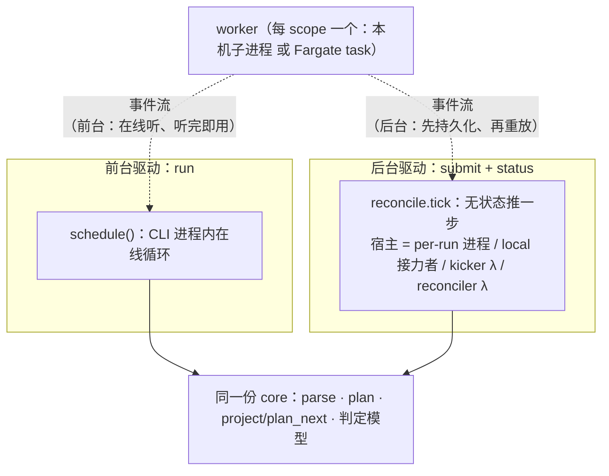
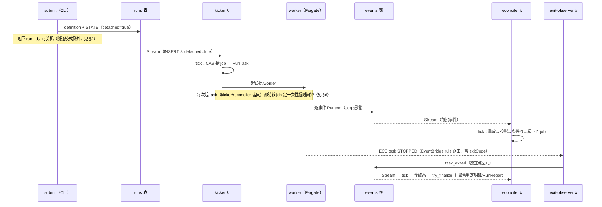
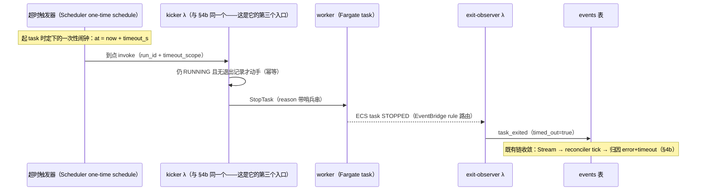

# 执行与推进模型导览：run / submit × local / cloud

> **文档定位（读前必知）**：本文是给**人**读的跨 ADR 合成导览——只讲**机制如何协同工作**（how），不复述决策理由与权衡（why 全在各 ADR，本文只给指针）。**权威永远在 ADR 与 code**，与本文冲突时以它们为准。为什么有这一层：ADR 按决策切片组织、为 AI 检索优化，人理解系统需要的是横切视图——「四种跑法下推进器分别是什么」这类问题的答案散在五六个 ADR 里，本文就是拼合之后的那个横切面。（本层的维护判据见 [CLAUDE.md](../../CLAUDE.md)「文档纪律」guides 条）

## 1. 心智模型：两种驱动、同一份 `core`

这个框架跑一个 run 有**两种驱动模型**，按命令分流：

- **同步驱动（`run`，下称前台）**：CLI 进程内的 `schedule()`（`core/gherkai_core/schedule.py`）全程在线——起 worker、消费事件流、判超时、收结果，一个循环干到底。local 下 CLI 关掉即中止（worker 随事件管道断开而早亡）；cloud 下关掉 CLI 只是放弃收结果——已在跑的 Fargate task 无人 StopTask，会继续跑完并继续计费。
- **无状态驱动（`submit` + `status`，下称后台/后台跑批）**：没有常驻的「调度进程」。核心是一个**纯编排步骤 `reconcile.tick`**（`core/gherkai_core/reconcile.py`；判定与决策是 `gherkai_core.project` 的纯函数，副作用全经注入的 EventLog/RunStore/Launcher）：读全量事件重放 → 算出当前该干什么 → 条件写落库 → 抢占式起下一个 job。**谁都可以来调它推一步**，它自己不记状态、不假设上一步是谁推的——这就是「无状态」的含义。

不管哪种驱动，worker→`core` 的话语只有两条：**事件流**（`scope_started`/`step_done`/… 的逐条事件）＋ **进程退出信号**（退出码——不是 worker「说」的，是父进程/平台观察到的；[ADR 0024](../adr/0024-worker-core-protocol.md) 协议）。判定「两件都要」：事件内容完整 ∧ 进程干净终止（防假绿）。两种驱动的差别本质是**有没有人在线守着听**——前台有：schedule 全程在线、听完即用，退出信号由 Engine adapter 当场观察；后台没有常驻听者：事件流被持久化、退出信号也被翻成 `task_exited` 记进同一份日志，于是谁来推进都能纯靠重放这份日志（各组合的物理通道见 §5）。

两种驱动共享同一份 `core`（parse/plan/project/判定模型），但**一个 run 只属于一种驱动**。cloud 档的分界线是 `detached` 标记：cloud `submit` 会在 runs 表的 STATE item 上写它，云端三 Lambda 据它只认领**后台 run**（带 `detached` 标记的），前台 run 的地盘绝不踏进（怎么保证的见 §7）。

local 档没有也不需要这个标记：不存在共享基础设施上的常驻推进器（每个 run 的推进者都是它自己 fork 出来的进程），没有谁需要被挡。

`reconcile.tick` 有**四个宿主**在不同场景下调用它：local 的 per-run 进程（= `submit` 时 `setsid` fork 出的推进进程）、**local** `status --wait` 的接力者（cloud 的 `--wait` 只在检测卡住时 invoke kicker、绝不在本机跑 `tick`——保 status 机器零 ECS 权限，见 §4b）、cloud 的 kicker Lambda、cloud 的 reconciler Lambda。四处跑的是同一份代码，差别只在注入的 adapter（事件从 SQLite 还是 DDB 读、job 用子进程还是 ECS RunTask 起）。



（图只画了第一条话语——事件流；第二条「进程退出信号」的观察者按组合各不相同，对照见 §5 的「退出观察者三对位」。）

> why 与护栏：[ADR 0034](../adr/0034-detached-batch-reconciler.md)（整体设计）、[ADR 0026](../adr/0026-schedule-module.md)（同步 schedule）、[ADR 0016](../adr/0016-execution-architecture-core-lib-run-model.md)（分层）。

## 2. 四组合一览

|           | **run（前台同步）**                                                                                                                                              | **submit（后台跑批）**                                                                                                                                                                                                                     |
|-----------|----------------------------------------------------------------------------------------------------------------------------------------------------------------|------------------------------------------------------------------------------------------------------------------------------------------------------------------------------------------------------------------------------------------|
| **local** | CLI 进程内 `schedule()`；worker = 本机子进程（fd3 事件流直达）；超时 = schedule 循环内计时到点；CLI 关掉即中止                                                      | **per-run 推进进程**（`setsid` 脱离 CLI）循环调 `tick`；事件旁路落 SQLite；该进程自兼退出观察者；本机需保持开机                                                                                                                               |
| **cloud** | 同一个进程内 `schedule()`，worker 换 Fargate task（job-in 走 S3、事件走 DDB events 表、adapter 轮询读）；云端 Lambda 对这种 run **一律不动作**（no-op；两道闸门，见 §7） | **三 Lambda 事件驱动链**：kicker（冷启动）、reconciler（主推进）、exit-observer（退出观察），事件串起、非调用链（§4b）；提交完关机也能跑完（例外：`--expose-local` 隧道模式下本机须保持开机联网，[ADR 0035](../adr/0035-local-app-testing-via-tunnel.md)） |

顺带钉一个贯穿全文的粒度：**job = scope**——一个 `@scope` 分组就是一个调度/执行单位（上云时坐实，[ADR 0017](../adr/0017-cloud-execution-fargate-over-runtime.md)），§6 超时闹钟的 per-(run,scope) 即 per-job。四格的详细解剖在 §3–§4；横切机制（事件通道/退出观察/超时）在 §5–§6。四格的权威：[ADR 0034](../adr/0034-detached-batch-reconciler.md)（两种驱动与后台跑批全部决策）、[ADR 0026](../adr/0026-schedule-module.md)（同步 schedule）、[ADR 0032](../adr/0032-fargate-execution-environment.md)（Fargate 执行面）。

## 3. 前台 `run` 的一生

```
plan(纯本地) → begin(落 definition + 初始态) → schedule 循环:
  ├─ 按并发闸起 worker(每 scope 一个)
  ├─ 逐行消费 worker 事件流 → ScopeStarted 刷 RUNNING+会话血缘(session id)、每 job 完成落判定(RunPersistence;事件本体不落盘)
  ├─ 静默卡死由心跳兜底、超出 job 超时预算即停 → handle.stop(local=SIGTERM→宽限→SIGKILL;cloud=StopTask)
  └─ 全部收敛 → finalize(终态一次落定)+ RunReport
```

local 与 cloud 在这条路上的差别**只在 Engine adapter**：

- **local**：`SubprocessEngine` spawn 本机 worker 子进程，事件走专用 fd（`EVENTS_FD`，三通道分离：事件/SDK 噪声/诊断各走各的）。
- **cloud**：`FargateEngine` 把 job JSON 放 S3、`RunTask` 起容器；worker 在容器里把事件逐条 PutItem 进 DDB events 表，adapter 这头**轮询 Query** 读回来，同时 `DescribeTasks` 盯着 task 死活。事件读取只扫 worker 的连续 seq 段——events 表里还有另一类「退出记录」item，为什么读端要避开它、谁保证前台 run 撞不上，见 §5 的键空间对照与 §7。

另外两个能力是前台驱动循环独有的、后台跑批**不具备**：`--fail-fast` 早停（以及由它派生的 skipped/aborted 态）与 network 瞬时故障的 job 级整体重试——后台档失败一律隔离、逐 job 各自收敛（[ADR 0026](../adr/0026-schedule-module.md) 失败隔离、[ADR 0031](../adr/0031-job-lifecycle-states-and-severity.md) 决定一）。

> 权威：[ADR 0024](../adr/0024-worker-core-protocol.md)（worker↔core 协议、三通道、退出码）、[ADR 0026](../adr/0026-schedule-module.md)（调度/心跳/优雅终止）、[ADR 0032](../adr/0032-fargate-execution-environment.md)（Fargate 执行面）、[ADR 0030](../adr/0030-realtime-persistence-seam.md)（实时写）。

## 4. 后台跑批 `submit` 的一生

### 4a. local 档：per-run 推进进程

```
submit:plan → 落 definition + 全 pending 初始态 → fork per-run 推进进程(setsid 脱离 CLI)→ CLI 返回 run_id
per-run 进程:run_reconcile_loop 循环调 tick
  ├─ tick 抢到 PENDING job → SubprocessLauncher 起本机 worker
  ├─ worker 的 fd3 原始事件行经 raw_sink 旁路落 SQLite(events 的持久通道)
  ├─ worker 退出 → 本进程 handle.wait() 拿 exitcode 写 task_exited(自兼"平台侧退出观察者")
  └─ 全 job 终态 → try_finalize 落 run 总 status → 重放聚合判定明细+RunReport → 拆临时物,退出
status [--wait]:只读投影查进度;--wait 还能接力推进——per-run 进程若死,接力者跑同一个 tick 把 run 推到收敛
```

要点：推进进程是 **per-run** 的（一个 run 一个，不是常驻守护）；`setsid` 让它活过 CLI/终端；SQLite 里的事件表结构刻意镜像 DDB events 表（心智对称）。

> 权威：[ADR 0034](../adr/0034-detached-batch-reconciler.md)「端到端流程」节的 local 半边。

### 4b. cloud 档：三 Lambda 链



- **kicker**：冷启动器，但不是「只起首批的薄壳」——它与 reconciler 同 code、同权限，跑完整的 `tick`。除 runs 表 Stream 外还有两个入口：`status --wait` 检测卡住时的主动调起（kickoff invoke，卡死救活），以及 job timeout 到点的闹钟调起（§6）。
- **reconciler**：主推进器。worker 每写一批事件，Stream 就触发它跑一次 `tick`——事件既是数据也是「心跳」，推进由事件级联驱动，无轮询常驻。
- **exit-observer**：把 ECS STOPPED 事件翻译成 events 表里的 `task_exited` 记录（cloud 档的「谁看见 worker 死了」）。它的触发面是 IaC 部署时建好的 EventBridge rule（按本 cluster 过滤 ECS task 状态变更 → STOPPED）——**常驻订阅、不由谁「启动」**；三个 Lambda **之间**没有互相启动/调用关系——各自订阅自己的事件源，链条是被事件串起来的；仅有的主动 invoke 都来自 Lambda 之外（`status --wait` 与超时闹钟踢 kicker，见上条与 §6）。
- 多宿主并发安全：`tick` 幂等，job 抢占走 CAS 条件写（PENDING→RUNNING 只有一个赢家）、投影落库走 HWM（投影只前进不后退的水位）与终态条件写——Stream 分片并发触发多个 Lambda 实例、叠加 `status --wait` 踢起的 kicker 调用，全都安全。
- **并发上限：声明随 definition 走，部署侧只留一道 cap**（与超时预算同构：都属 run 的定义）。`run` 与 `submit` 都把 `--max-concurrency` 落进 definition（`RunMeta.max_concurrency`），detached 的推进器一律读 meta——local per-run 进程与 `status --wait` 接力者都以 meta 为准（各自的 flag 只是 meta 无值时的回落，接力不会悄悄改这个 run 的并行度）；同步 `run` 在同进程内直接用 flag（没有通道问题），meta 照落、只为 definition 诚实；cloud 档取 `min(definition 声明, 部署侧 cap)`，cap = reconciler/kicker 的 Lambda env `MAX_CONCURRENCY`（IaC 设，当前 8）。cap 的 why：并发闸的是**worker（Fargate task）的并行数**（per-run 语义：单 run 内最多几个 job 并行），task 跑在部署方的 cluster、烧部署方的账单，故部署方保留总量控制权——但它是**上限、不是真源**，提交侧在 cap 以内说了算。**local 无 cap**：worker 与推进进程都跑在提交者自己的机器、烧自己的凭证——提交者即买单方，没有第二方需要保护；cap 只存在于「提交者与部署方分离」的 cloud 档。声明超 cap 时不会静默按 cap 跑：`submit --backend cloud` 的 preflight 读推进器 env 比一下，超了就提示「本 run 将按 cap 并行、要更高并发改 IaC」——但**不拦提交**（按 cap 跑只是慢，产物照落用户给的前缀；对比 `REPORT_DIR` 不一致会把产物写去别处、故退 2）。旧 definition（无此值）按 1，与打通前行为一致（why 见 [ADR 0034](../adr/0034-detached-batch-reconciler.md) 机制四）。

> 权威：[ADR 0034](../adr/0034-detached-batch-reconciler.md)（机制一–四、端到端流程、重议闸门）、[ADR 0033](../adr/0033-iac-aws-backend-and-composition-wiring.md)（三 Lambda 的 IaC/权限/触发面）。

### 4c. 读侧：进度怎么看、结果落在哪

后台驱动的另一半是「怎么观察」。事件流是**写模型**，读模型是它的投影 **RunState**（cloud = runs 表的 STATE item，local = `run_state.json`）——投影只在 `tick` 里落一次，外部（`status`、未来 WebUI）**只读投影、从不自己重放事件**。由此推出四件事：

- **`status`（不带 `--wait`）纯只读、零副作用**——看到的新鲜度取决于最近一次 `tick` 是什么时候；它不推进、也不 kickoff。
- **run 级 status 的取值语义**：投影写被钳在 `pending`/`running` 两档——全部 job 还没起过 = `pending`（`status` 的「推进可能未启动」提示正是据此），任一 job 已推进 = `running`；run 级**终态**由 `try_finalize` 一次落定（提交点），**读到终态 = run 已提交**。
- **退出码分层**（CI 接线最易建错心智）：`submit` 的退出码只表示「提交成功与否」、**不是判定**；判定退出码由 `status --wait` 等到终态后给（passed→0 / 其余终态→1；不带 `--wait` 且未到终态 → 0，那是「查询成功」；查不到 run → 2）。根因：CLI 脱离后不再有内存里的判定终值。
- **结果落哪**：`try_finalize` 只落 run 总 status；判定明细（`jobs/*.json`）与 RunReport 由推进器随后**从事件流重放聚合**（幂等，local per-run 进程与 cloud reconciler 共用同一份收尾逻辑）。落点：local = `--report-dir/<run_id>/`，cloud = S3 桶下 `<report_dir>/<run_id>/`——cloud `submit` 的 `--report-dir` 须与推进器侧一致（提交前探活会比对、不一致退 2），否则「跑完了却在自己给的前缀下找不到结果」。

最后一条不对称（**掐得掐不得**）：cloud 的 `--wait` 检测卡住时只是**踢一脚** kicker（fire-and-forget），踢完随时可离场——云端链自己跑完；local 的 `--wait` 接力者一旦接手**就是唯一推进者**，掐掉它 run 就地停摆（已 claim job 的计时也随进程一起丢，靠下次接力恢复）。根因：主推进器的位置不同（云端 Lambda vs 本机进程）。

> 权威：[ADR 0034](../adr/0034-detached-batch-reconciler.md)（机制三：投影钳制与条件写；「命令形态」节：status/退出码）、[ADR 0030](../adr/0030-realtime-persistence-seam.md)（终态提交点）、[ADR 0031](../adr/0031-job-lifecycle-states-and-severity.md)（决定五：退出码语义）。

## 5. 同一条事件流的四条物理通道（横切对照）

§3–§4 按跑法纵切讲完了生命周期；从这节起横过来看跨组合的机制。第一条就是 §1 说的那条事件流——逻辑上它在四个组合里完全同构（同一套事件、同一份解析），物理载体却各不相同：

| 组合         | worker 写到哪                        | 谁读、怎么读                                                                       |
|--------------|--------------------------------------|-----------------------------------------------------------------------------------|
| local run    | 专用 fd（`EVENTS_FD`）                 | CLI 进程 schedule 逐行阻塞读（内存流，不落盘）                                       |
| local submit | 同上 fd                              | per-run 进程读的同时经 `raw_sink` **旁路原样落 SQLite**；`tick` 从 SQLite 全量重放 |
| cloud run    | worker 直接 PutItem 进 DDB events 表 | CLI 进程 `FargateEngine` 轮询 Query（只扫 worker seq 段）                           |
| cloud submit | 同上                                 | events 表 **Stream 触发 reconciler** Lambda；`tick` 从表里全量重放                 |

events 表里有**两个键空间**：worker 的连续 seq 段（事件本体——seq 从 1 连续递增、每 PK 单写者，读端据此判漏读/乱序，即**断号检测**），和退出观察者写的 exit 记录（保留高位 SK + `item_type='exit'`，不入 seq 段、不参与断号检测）。读端各按形态处理：前台读端（`FargateEngine`）按段界排除 exit 记录；无状态读端（`DdbEventLog.records()`）全 PK 读、按 `item_type` 分流后喂重放；「只问某个 scope 退没退」的超时处置路径走 `has_exit` 单点查。

**退出观察者三对位**（谁看见 worker 死了）：前台 = Engine adapter 自己看（subprocess 的 `proc.wait` / Fargate 的 `DescribeTasks`）；local `submit` = per-run 进程 `handle.wait()`；cloud `submit` = exit-observer Lambda。

> 权威：[ADR 0024](../adr/0024-worker-core-protocol.md)（事件协议/DDB 态）、[ADR 0034](../adr/0034-detached-batch-reconciler.md)（机制一：退出记录独立键空间；机制二：两件都要的收敛判据）。

## 6. `job` 超时预算（timeout）：三路同形的兜底

每个 `job` 有超时预算，按**墙钟**（真实流逝时间）计。声明用 `@timeout:N` tag 或 `--default-job-timeout`，随 definition 落在 `Job.timeout_s`（ADR/CONTEXT 里称「job 墙钟预算」）。三条执行路径**各自落实同一形态的兜底**（ADR/code 里称 enforce）：超时 → 停 worker → 归因 `error + timeout`：

| 路径         | 到点机制                                                                                                                                                               | 停法                                                                                                                                                                                         |
|--------------|------------------------------------------------------------------------------------------------------------------------------------------------------------------------|----------------------------------------------------------------------------------------------------------------------------------------------------------------------------------------------|
| 前台 `run`   | schedule 循环内计时到点（deadline）                                                                                                                                      | local=`handle.stop(grace)`（SIGTERM→宽限→SIGKILL）；cloud=`StopTask`（宽限由 task-def `stopTimeout` 决定、不逐次传——上限与取舍见 [ADR 0032](../adr/0032-fargate-execution-environment.md) 结论 4） |
| local submit | per-run 进程 launcher 的到点计时器（deadline timer；进程若中断，由接力恢复重建计时）                                                                                       | 同 local `handle.stop(grace)`                                                                                                                                                                |
| cloud submit | 起 task 时给该 job **定一个一次性到点闹钟**（EventBridge Scheduler one-time；与 §4b exit-observer 的 EventBridge **rule** 同名不同物——那是事件总线订阅、这是独立定时服务） | 到点由 kicker 处置，整条链见下图；另有任意 `tick` 的防御扫作双保险                                                                                                                             |

cloud 路径的超时处置是一条多跳链，时序如下。那个「闹钟」（ADR/code 里叫 arm/武装一个 one-time schedule）是 per-(run,scope) 的短命资源：schedule 名 = `{prefix}job-timeout-<sha1(run_id#scope_id) 摘要>`（前缀走 `gherkai_runtime.names` 命名真源、IaC 的 IAM 资源域同源推导），到点触发即自动删——所以控制台里平时看不到它：



> 权威：[ADR 0034](../adr/0034-detached-batch-reconciler.md)「job timeout」节（取舍/归因链/防御扫）、[ADR 0019](../adr/0019-feature-tags-scope-and-engine.md)（`@timeout:` tag）。

## 7. 为什么云端 Lambda 不会抢前台 run

`run --backend cloud` 与 `submit --backend cloud` 共享同一套表和 Lambda——前台 run 照样往两张表里写（definition 落 runs 表、worker 事件落 events 表），Stream 里照样有它的记录——**若无闸门，云端推进器就会被这些记录唤醒、跑来推前台 run**（双开推进器：同一 scope 起两个 task）。两道闸门拦在不同层，判据同源（STATE 上的 `detached` 标记）：

- **kicker 这扇门**：runs 表 Stream 的事件源 **filter**（`INSERT ∧ detached=true`）在**事件源层**就滤掉——前台 run 的 STATE 不带标记，kicker 根本不会被 invoke。
- **reconciler 这扇门**：events 表的 item 身上没有 `detached` 标记、事件源层滤不了——Lambda 会被 invoke，闸门在 **handler 内**：`tick` 装配前先查 `is_detached`，非后台 run 直接不动作（日志会出现 `skip: run … 非 detached`）。
- **exit-observer 的同源分流**（严格说不是第三扇推进器闸门——它不推进，防的是另一件事）：不给前台 run 写退出记录，免得无 `body` 的 exit item 混进前台 run 的事件流（前台的退出观察由 Engine adapter 自己做，§5）；判据同一个 `is_detached`。

> 权威：[ADR 0034](../adr/0034-detached-batch-reconciler.md)（「filter 必须区分写入者」条）、[ADR 0033](../adr/0033-iac-aws-backend-and-composition-wiring.md)（Stream/filter 资源；events 表那半只能在 handler 内判）。

## 8. 延伸阅读

| 想深入的主题                                                    | 去哪读                                                               |
|-----------------------------------------------------------------|----------------------------------------------------------------------|
| 无状态跑批全部决策/护栏/被拒方案                                | [ADR 0034](../adr/0034-detached-batch-reconciler.md)                 |
| 同步调度器（并发/心跳/失败隔离/优雅终止/事件归约）                | [ADR 0026](../adr/0026-schedule-module.md)                           |
| worker↔core 协议（事件三通道/job 入口 stdin·`JOB_S3_URI`/退出码） | [ADR 0024](../adr/0024-worker-core-protocol.md)                      |
| job 生命周期状态机与严重度排序（severity）                        | [ADR 0031](../adr/0031-job-lifecycle-states-and-severity.md)         |
| Fargate 执行面（停止宽限 grace/中断韧性）                         | [ADR 0032](../adr/0032-fargate-execution-environment.md)             |
| 实时持久化接缝（终态提交点 commit point/条件写）                  | [ADR 0030](../adr/0030-realtime-persistence-seam.md)                 |
| 云资源 IaC/命名/提交前探活（preflight）                           | [ADR 0033](../adr/0033-iac-aws-backend-and-composition-wiring.md)    |
| 分层总纲（core/runtime/cli/engines）                              | [ADR 0016](../adr/0016-execution-architecture-core-lib-run-model.md) |
