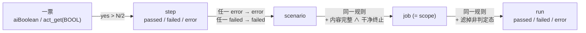

# 判定是怎么算出来的：从一票到退出码

> **文档定位（读前必知）**：本文是给**人**读的跨 ADR 合成导览——只讲**判定如何被算出来**（how），不复述决策理由与权衡（why 全在各 ADR，本文只给指针）。**权威永远在 ADR 与 code**，与本文冲突时以它们为准。为什么有这一层：一个 run 的「结论」要经过四层归约、两根正交的轴、七个状态和各命令不同语义的退出码，任何单个 ADR 只讲其中一片（0014 讲投票、0031 讲状态与 severity、0034 讲脱离后的退出码…），人要的那张全景图得自己拼——本文就是拼好的那一张。（本层的维护判据见 [CLAUDE.md](../../CLAUDE.md)「文档纪律」guides 条）

姊妹页分工，本文不越界：worker 怎么被起来、事件怎么到 core、超时闹钟谁上、四种跑法的推进链 → [执行与推进模型导览](./execution-and-reconciliation.md)；`status` / `error_type` / `votes` 在 `--json` 里的**字段名、类型、何时出现** → [CLI `--json` 字段契约](./cli-json-contract.md)（本文不重复它的表）；每步证据怎么读 → [artifacts-and-evidence](./artifacts-and-evidence.md)；确定性 step 怎么写、怎么被派发 → [deterministic-step-lifecycle](./deterministic-step-lifecycle.md)；判定与运行态落在哪张表/哪个桶 → [cloud-backend-carriers](./cloud-backend-carriers.md)。

## 1. 四层归约：一票 → step → scenario → job → run

判定是**逐层归约**出来的，每层都有一个明确的真值符号。core 从不重算票、也不重判 step——上层只做归约。

| 层 | 结论怎么定 | 真值符号 |
|---|---|---|
| **一票** | 一次布尔 AI 调用的返回值 | Nova：`act_get(instruction, BOOL_SCHEMA)` → `bool(r.matches_schema and r.parsed_response)`；Midscene：`agent.aiBoolean(instr)` |
| **step** | AI 断言（`Then`）：`yes > N/2` → `passed`/`failed`，事件带 `votes={yes,total}`。确定性注册表命中：`AssertionError`→`failed`、其它异常→`error`。引号内 URL 的导航步 / `When`·`Given` 动作步：正常返回→`passed`、抛异常→`error` | `_run_step`（Nova）/ `runStep`（Midscene） |
| **scenario** | 任一 step `error`→`error`；任一 `failed`→`failed`；否则 `passed`。**被短路跳过的 step 不进这个列表** | worker 侧 `_aggregate` / `aggregate`；结论经 `scenario_done` 事件上报 |
| **job**（= scope） | 同步 `run`：事件流正常 EOF **且**见过 `scope_done` → 各 scenario 归约；否则按中止来源分流（§3）。无状态跑批：「两件都要」谓词（内容完整 ∧ 进程干净终止） | `schedule._Worker._run_once` / `project._job_status` |
| **run** | 任一 job `error`→`error`；任一 `failed`→`failed`；否则 `passed`。**入口先滤掉非判定态** | `project._aggregate`——唯一一份，`schedule._aggregate` 只是它的别名 |

几个容易问到的点：

- **N 从哪来**：`Job.assertion_votes`（CLI `--assertion-votes`，默认值见 `--help`）。阈值是多数票 `yes > N/2`，两个引擎各自实现、同一个式子。`total == 1` 时 `run` 的人读输出（实时事件行与终态汇总，`render.py` 的 `format_event` / `render_text`）与报告 `index.html` 的 step 行都锁 `total > 1`、不显 tally；`explain` 的逐步视图**有意**不设这道闸、`votes 1/1` 照显——`votes` 的存在就是「这是 AI 断言」的标记，给 agent 分辨用（ADR 0042 决策四）。机读层（`--json` / evidence）始终给完整 `votes`。
- **core 只搬不判**：`project.reduce_event` 把 `StepDone` 的 `status`/`votes`/`error_type`/`message`/`report_refs` 原样搬进 `StepResult`；scenario 判定**只**由 `ScenarioDone` 事件写入 `scenario_status`，`step_done` 分支不碰它。
- **同步与无状态两条路共用同一份归约**：`reduce_event`（单事件归约）和 `_aggregate`（终态聚合）都住 `core/gherkai_core/project.py`，`schedule` delegate 过去。同步 run 沿事件流实时喂，reconciler 从持久事件全量重放喂——两条路收敛到同一终值。



> 权威：[ADR 0014](../adr/0014-ai-first-assertions.md)（AI 断言与投票纪律）、[ADR 0024](../adr/0024-worker-core-protocol.md)（事件协议、三态、投票 tally 字段）、[ADR 0026](../adr/0026-schedule-module.md)（三级归约）、[ADR 0031](../adr/0031-job-lifecycle-states-and-severity.md) 决定三（`_aggregate` 入口过滤）；code：`core/gherkai_core/model.py`、`project.py`、`schedule.py`、`engines/novaact/gherkai_worker_novaact/run_scope.py`、`engines/midscene/src/worker/run-scope.mts`。

## 2. 七个状态：含义与「我该做什么」

`Status`（`core/gherkai_core/model.py`）共七个值：**五个终态** + **两个前置态**。`TERMINAL_STATUSES` 是终态的单一真源，且**取补而非正列**（`frozenset(Status) - _PRE_TERMINAL`），所以新增终态自动入集。

| 状态 | 谁赋、在哪 | 活在哪几级 | 含义 | 我该做什么 |
|---|---|---|---|---|
| `passed` | worker 上报 / core 归约 | step·scenario·job·run | 断言都过了 | — |
| `failed` | worker 上报（多数票没过 / 确定性 `AssertionError`） | step·scenario·job·run | **测试发现了问题** | 看现场，不要无脑重跑：`gherkai explain <run_id>` 逐步看「问了 AI 什么、AI 看见了什么」；报告里有引擎原生 report / trajectory |
| `error` | worker 上报（act 抛异常）/ core 派生（超时、worker 崩、内容不完整、起 worker 失败） | step·scenario·job·run | **没能跑完测试** | 先看 `error_type` + `message` 分因（§3）：`timeout`/`network_error` 多半可原样重跑；`engine_error`/`guardrail` 先翻 worker 日志 |
| `skipped` | **core 本地赋**（两处，见 §3） | job（fail-fast 下 worker 从未 spawn）· step（scope 内短路） | 这一单元没跑 | job 级：没执行、没花钱、可无脑重跑（但整批必伴随别人的 `error`，真凶在别处）。step 级：真凶是它上游那个 `error` step |
| `aborted` | **core 本地赋**（`schedule` 的 fail-fast 分支） | job | 起过了、跑一半被掐 | **别无脑重跑**：会话动过、可能有副作用；先看现场（`session_id` 已保留，可对上 worker 日志/轨迹） |
| `pending` | `create_run` 写初始态 | job（`JobState`）·run（`RunState`） | 还没起 | 等；提交较久仍**所有** job 都 pending 时 `status` 会提示用 `--wait` 接力推进 |
| `running` | 收到 `scope_started` 后刷 / 无状态路径 CAS claim | job·run | 在跑 | 等 / `status --wait` |

两条边界，读代码时最容易踩：

- **worker 只会报三态**。`wire.py` 的 `event_from_json` 只在 `step_done`/`scenario_done` 上做 `Status(d["status"])`，wire 上能出现的只有 `passed`/`failed`/`error`；`scope_done` 没有 `status` 字段，只当「内容完整」信号（job 判定由 core 归约，见 §1）。其余四态全是 **core 内态**：`skipped`/`aborted` 由 `schedule` 在「没起 / 被掐」时本地构造，`pending`/`running` 由实时写落库。
- **前置态绝不进判定真值**。`JobResult.status` 只会是五个终态之一；强制点在 `project.project_full`——收尾聚合时任一 job 仍非终态即抛 `NonTerminalSnapshot`，那一轮 tick 一份判定都不落（不让 `running` 混进 `jobs/*.json`）。同步 run 路径由归约器天然只产终态。前置态也不在 severity 表里（§4）。

> 权威：[ADR 0031](../adr/0031-job-lifecycle-states-and-severity.md) 决定一 / 决定一·补（两组派生态的定义、行动含义、`TERMINAL_STATUSES` 取补）、[ADR 0024](../adr/0024-worker-core-protocol.md)（wire 三态）、[ADR 0030](../adr/0030-realtime-persistence-seam.md)（pending/running 何时被写）。

## 3. 两根正交的轴，和 `error_type` 家族

### 3a. `status` × `shortcircuited`

`StepResult` 有两个独立维度：`status` 回答「跑出什么结论」，`shortcircuited: bool` 回答「为什么是 skipped」。

一个 scenario 内某 step 报 `error` 后，worker **不再对后续 step 调 AI**（省钱 + 不在损坏环境上跑出误导性 `failed`），改为给每个被跳过的 step 发一条独立事件 `step_skipped`（平行于 `step_done`，无 `status`/`votes`/`cost` 字段——「这步没跑」是执行事实、不是判定结论，故不塞进三态）。core 收到它就地构造 `StepResult(status=SKIPPED, shortcircuited=True, duration_ms=None)`。

**关键：它绝不污染上层。** `reduce_event` 的 `StepSkipped` 分支只把 `StepResult` 暂存待挂，**不写 `scenario_status`** → 压根不参与 scenario 归约（`_aggregate` 的 `_NON_VERDICT` 过滤只是第二层保险）。所以 scenario/job 的判定由上游那个 `error` step 决定，与后面短路了几步无关。渲染层的连锁失败旁注读 `shortcircuited` 这个布尔（`render.py`：`⚠ 因前置 step error 被跳过（未执行）`），不靠「按 status 顺序猜」。

短路判据锁 `status == error`（不看 `error_type`），两引擎对称；短路只作用于**本 scenario**，跨 job 的中止是 fail-fast 的职责，两者正交。

**别把两级 skipped 混成一件事**：

| | 谁被 skip | 有 `StepResult` 吗 | 花过钱吗 |
|---|---|---|---|
| **job 级**（fail-fast） | 整个 job 从未 spawn | 无（`JobResult.scenarios=[]`） | 没有，`session_id` 必 `None` |
| **step 级**（scope 内短路） | job 起了、上游 error 之后的那些 step | 有（`shortcircuited=True`） | 会话已起、前面的步已计费 |

### 3b. `error_type`：谁在赋、赋什么

类别集的单一事实源是 `model.ErrorType`（一个 `Literal`，**有意不作字段注解**——wire 必须容忍 worker 报的未知类别，故各 `error_type` 字段都是 `str | None`）。

| `error_type` | 伴随 status | 谁赋、在哪 |
|---|---|---|
| `assertion_failed` | `failed` | worker：AI 断言未过多数票（message 带 `yes/N` 与断言文）/ 确定性 `AssertionError` |
| `timeout` | `error` | ① core：job 墙钟预算到点（`schedule` 的 deadline 分支；无状态路径经 `TaskExited.timed_out` → `_reduce_scope` 覆盖归因）② Nova worker：单次 act 到点（`_classify_act_error` 认 `ActTimeoutError`） |
| `guardrail` | `error` | Nova worker：SDK 护栏异常（`ActGuardrailsError`/`ActStateGuardrailError`）。Midscene 侧无此细分 |
| `network_error` | `error` | 两侧 worker：act 中途的瞬时网络故障（**仅分类、不触发重试**——act 不幂等）；core：worker 以网络专用退出码退出（建连失败、退避耗尽） |
| `engine_error` | `error` | 兜底：起 worker 失败、worker 迭代中崩、「干净退出却没发完 `scope_done`」、其余未细分异常 |
| `navigation_error` | （`error`） | **协议里声明、当前无生产者**：两引擎的导航失败按异常性质落 `network_error` 或 `engine_error` |

`skipped`/`aborted` 的 `error_type` 恒 `None`——「为什么没跑」只在 `message` 里，所以人读渲染在无分类时也照样显 `message`（否则只剩一个光秃的态）。

### 3c. 两个常被问的分类边界

- **超时的 job 是 `error` + `timeout`，不是 `aborted`。** code 里 `self_stopped` 这个布尔被超时与 fail-fast **两条路径共用**，所以回填判据锁的是 `abort_flag`：只有 fail-fast 触发的中止落 `aborted`，超时分支一律 `error` + `error_type="timeout"`。无状态路径同口径（`TaskExited.timed_out` → `ERROR`，归因由 `_reduce_scope` 覆盖成 `timeout`，因为 stop 本就是超时处置发起的）。为什么这么切见 [ADR 0031](../adr/0031-job-lifecycle-states-and-severity.md) 决定一的注（「aborted 只认 fail-fast」）。
- **network 重试耗尽是 `error`，不是 `skipped`。** `skipped` 的边界严格是「worker 从未 spawn」。建连失败的 job 已经开过会话、已经计费；`saw_step == False` 只表「可安全重试（没有 act 副作用）」，不表「没花钱」——故它照常进 run 级聚合。补一条现状：`ScheduleOpts.network_retry` 默认 0 且 CLI 没接这个旋钮，所以今天 `run` **不做** job 级整批重跑；起效的是 worker 自己的建连退避（`_CONNECT_ATTEMPTS` / `_BACKOFF_S`，只裹幂等的建连段），退避耗尽即以网络专用退出码退出，core 记 `error` + `network_error`。
- 顺带：worker 收到停止信号时**不为没跑完的单元编造判定**——Nova 在投票循环与 step 循环顶查停止标志，票没投满就不 emit 带 verdict 的 `step_done`、也不发 `step_skipped`；Midscene 走 SIGTERM 收尾序列（释放会话 → 抢传 → 排空队列）。两侧都是「未完成的单元交 core 按派生态处理」，只是停止的处置形态不同。

> 权威：[ADR 0031](../adr/0031-job-lifecycle-states-and-severity.md) 决定六（`step_skipped` 事件 + `shortcircuited` 正交布尔 + 「绝不写 `scenario_status`」不变量）、决定一（skipped/aborted 边界）、[ADR 0028](../adr/0028-transient-network-ssl-resilience.md)（两层重试、`network_error` 白名单、「绝不重试 act」、core 层 job 重试门槛）、[ADR 0024](../adr/0024-worker-core-protocol.md)（终止契约、退出码 out-of-band 通道）；code：`model.py` 的 `ErrorType`/`StepSkipped`/`StepResult.shortcircuited`、`project.reduce_event`、`schedule._Worker._run_once`、两个 worker 的 `_classify_act_error` / `isTransientNetwork`。

## 4. severity：不是字母序；以及 run 级为什么没有 skipped/aborted

`_STATUS_SEVERITY`（`model.py`）给**终态**定义了一套数值序：

```
skipped = -1  <  passed = 0  <  failed = 1  <  error = 2  <  aborted = 3
（skipped 最轻——没执行，最该被无视；aborted 最重——有现场，最该被人看）
```

两件事必须记住：

1. **绝不拿 `Status` 字符串比大小**。字母序 `'error' < 'failed' < 'passed'` 与严重度**正好反**。要比就查表 / 调 `severity()`；前置态查表即 `KeyError`（它们不是判定结论，无 severity）。
2. **这张表今天的角色是「约定」，不是「计算引擎」**。`_aggregate` 用显式 `any(...)` 实现三态归约（在三个判定态上与「取 severity max」等价）；报告配色是按同一序**手工映射**的另一张表（`core/gherkai_core/adapters/report_store/local.py` 的 `_STATUS_COLOR`：passed 绿 / failed 红 / error 琥珀 / skipped 弱化灰 / aborted 紫 / pending·running 蓝——每态各一色，都不落兜底灰，否则 aborted 看不出严重）；`severity()` 本身当前只被单测引用（`core/tests/test_lifecycle_states.py` 一行钉死全序）。**加新终态时 `_STATUS_SEVERITY` 与 `_STATUS_COLOR` 两处要一起改。**

两个相邻但**判据不同**的集合，别混（它们在 skipped/aborted 上有意重叠）：

| 集合 | 按什么切 | 含 skipped/aborted？ | 谁引它 |
|---|---|---|---|
| `TERMINAL_STATUSES` | 生命周期（还会不会变） | 含 | `--wait` 轮询、`status` 退出码判定与终态才打的产物位置、`explain` 的「run 仍在跑」提示、`project_full` 的不变量检查、隧道守护的拆除判据（`runtime/gherkai_runtime/tunnel_host.py`：读到终态即提前拆，否则等满 TTL）；另有一处**取补**用法——revision 清理的「还有未达终态的 run 引用吗」安全阀（`deploy_aws/gherkai_deploy_aws/workers.py`）。跨栈护栏钉「消费方全引这一份、不各写白名单」 |
| `_NON_VERDICT` | run 级判定（算不算结论） | 含（**另含** pending/running） | `_aggregate` 入口过滤 |

**run 级永不出现 skipped/aborted**：`_aggregate` 入口就把它们（连同两个前置态）滤掉了 → `RunResult.status` ∈ {`passed`,`failed`,`error`}。这条过滤在无状态投影路径上是**承重**的（`project` 每轮 tick 全量重放，`jobs_state` 真实含 pending/running 的 job 并原样喂进去；同步 run 路径喂的全是终态、过滤是 no-op）。

控制面的 `RunState.status` 多两个可能值：跑批期间是 `pending`/`running`（同步 `run` 路径整段保持 `pending`、`finalize` 一次落终态；无状态路径每轮投影写按 `projected_run_status` 钳在 pending/running——run 级终态是 `finalize` 这个提交点的专属，提前落会把 run 卡成永不 finalize）。

> 权威：[ADR 0031](../adr/0031-job-lifecycle-states-and-severity.md) 决定二（severity 序、视觉映射、「run 级为何不含 skipped/aborted」的洞察）与决定三（入口过滤）、[ADR 0034](../adr/0034-detached-batch-reconciler.md) 机制三（投影写钳制）、[ADR 0030](../adr/0030-realtime-persistence-seam.md)（提交点）。

## 5. 退出码：每条命令回答的是**不同的问题**

| 命令 | 退出码回答什么 | `0` | `1` | `2` |
|---|---|---|---|---|
| `run` | **判定** | run 级 `passed` | 其余终态（`failed`/`error`，含伴随 error 的 skipped/aborted 批次）；另有一条：cloud 档跑到一半落库不可达 | 开跑前的配置/可达性问题 |
| `status`（不带 `--wait`） | 查到了吗（读到终态时才顺带表判定） | 查到了——**含未达终态**（查询本身成功） | 读到的终态非 `passed` | run 不存在 / 云端不可达 / 版本不匹配 |
| `status --wait` | **判定** | 轮到终态且 `passed` | 轮到终态、非 `passed` | 同上，另加「接力 Lambda 不存在（`--prefix` 配错或后端未部署）」 |
| `submit` | 提交成功了吗（≠ 判定） | 已提交、`run_id` 已打印 | — | 配置/可达性问题 |
| `plan` | 这批能跑吗（零 AWS、零副作用） | 能 | — | 配置错、写法错、使用方 steps 加载失败 |
| `explain` | 证据读出来了吗（**从不表判定**） | 渲染出来了——**run 判 failed 也退 0**；判定明细还没落地同样退 0 | — | 参数写错（如 `--step` 没同时给 `--scenario`）、run/scope 查不到、云端读不到 |
| `doctor` | 必修项都过了吗 | 全过 | — | 任一 `required` 项 fail（可选能力缺失只标 `-`，不影响退码） |

一句话记：**表判定的只有 `run` 与 `status`，也只有它们会退 1**；`submit`/`plan`/`explain`/`doctor` 全是 0/2 的「做成了 / 没做成」。（部署方命令 `deploy`/`destroy` 不在本表口径内：它们原样透传 cdk 的退出码，`deploy` 退 1 = cdk 或其后的 worker 镜像步骤失败、账户已被改动，重跑幂等收敛——别按判定码读。）`run` 的判定码读 `schedule` 返回的内存 `RunResult.status`（必是终态，不回读可能停在 pending 的落库态）；`status` 的判定码读回落库的 `RunState`——两路 `status`（local/cloud）共用同一个 `_render_status`，行为一致。

**CI 该接哪一条**：

- **前台阻塞**：`gherkai run …` 一条命令即拿判定码。
- **后台跑批**：`gherkai submit …` 拿 `run_id`（退 0 只说提交成功），再 `gherkai status <run_id> --wait` 拿判定码——CLI 脱离后不存在「内存 RunResult 终值」，判定只能来自读回的终态 `RunState`。
- 别把 `explain` 当判定门（它是证据渲染器），也别把不带 `--wait` 的 `status` 当判定门（未达终态它退 0）。
- 分界线是**有没有真的开跑**：开跑前的一切（feature 读不到、写法/参数不合法、worker 定位不到、凭证/region/资源/版本不对）退 `2`；跑起来之后的结论退 `0`/`1`。给使用者的口径见 `cli/README.md`「退出码」；`--json` 下**先按退出码分流再解析** stdout。

> 权威：[ADR 0031](../adr/0031-job-lifecycle-states-and-severity.md) 决定五（退出码基于 run 级判定 + 数据源）、[ADR 0034](../adr/0034-detached-batch-reconciler.md)「命令形态」（退出码语义分层：submit=提交、判定归 `status --wait`）、[ADR 0041](../adr/0041-agent-facing-cli-affordances.md) 决策四（`doctor` 只看必修项的 0/2）、[ADR 0042](../adr/0042-step-evidence-and-explain.md) 决策四（`explain` 只 0/2、不重复表判定）；code：`cli/gherkai_cli/__main__.py` 各 `_cmd_*` 的 return 与 `_render_status`。

## 6. 延伸阅读

| 想深入的主题 | 去哪读 |
|---|---|
| 状态机与 severity 的全部决策、被拒方案、留口子（含「主动 skip 的退出码语义待定」） | [ADR 0031](../adr/0031-job-lifecycle-states-and-severity.md) |
| AI 断言为主的取向、投票纪律、N 的缺省与阈值为何还没定 | [ADR 0014](../adr/0014-ai-first-assertions.md) |
| 事件协议、三态、成本信封、终止契约、退出码通道 | [ADR 0024](../adr/0024-worker-core-protocol.md) |
| 并发/失败隔离/fail-fast/心跳/优雅终止 | [ADR 0026](../adr/0026-schedule-module.md) |
| 网络瞬时故障的两层重试与分类白名单 | [ADR 0028](../adr/0028-transient-network-ssl-resilience.md) |
| 脱离式跑批的「两件都要」谓词、投影写、job timeout 归因链 | [ADR 0034](../adr/0034-detached-batch-reconciler.md) |
| step 级证据与 `explain` | [ADR 0042](../adr/0042-step-evidence-and-explain.md) ·[artifacts-and-evidence](./artifacts-and-evidence.md) |
